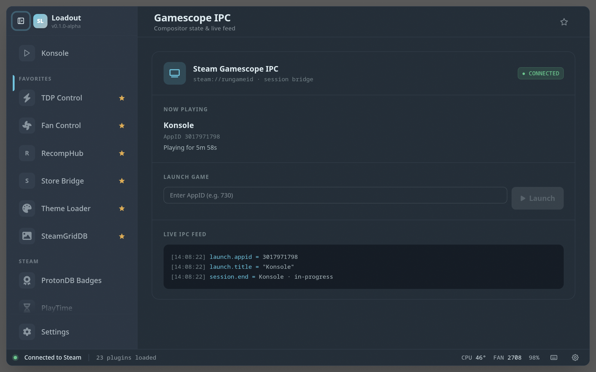

# Loadout

A TypeScript-native plugin platform + on-screen overlay for Linux gaming
handhelds and desktops running Gamescope. Think **Decky Loader re-imagined in
one language**: the plugin host, plugin backends, plugin UIs, and the overlay
itself are all TypeScript on Bun — no Python service, no multi-runtime interop.

**Linux only.** Loadout targets distros with Steam Gaming Mode — **SteamOS**,
**Bazzite**, and **CachyOS**. There is no macOS or Windows build.

> **Status: early.** This repository is a minimal, freshly-rebuilt version of
> the project. It currently ships the full platform plus **one example plugin**
> (`steam-gamescope-ipc`) as a proof-of-concept. The remaining plugins are
> being migrated back in one at a time, each reviewed as it lands.

## What it is

Linux-native handhelds (Steam Deck, ROG Ally, OXP, Ayaneo, …) lack a
first-party way to tweak TDP, fan curves, RGB, launch options, and more
without dropping to a desktop shell. Decky Loader fills that gap, but it's a
Python service that injects into Steam's own CEF process and monkey-patches
React internals — powerful, but fragile across Steam UI updates and a
two-language plugin API.

Loadout takes a different approach:

- **Bun main process** runs a small HTTP + WebSocket server. It discovers
  plugin backends, routes typed RPC, and serves compiled plugin bundles.
- **CEF overlay** (Electrobun) is a standalone composited window layered over
  Gamescope via X11 atoms — our own surface, not an injected panel, so Steam
  redesigns don't break it.
- **Optional Steam UI injection** via CEF's remote-debug protocol is available
  for plugins that *do* want to reach into Big Picture (compatibility badges,
  overlays, CSS theming) — but it isn't the default path.
- **Shared TypeScript SDK** (`@loadout/ui`) gives plugin authors typed RPC,
  themed React components, gamepad-aware spatial navigation, and persistent
  user settings out of the box.

A full plugin — backend + UI — is typically 150–300 lines of TypeScript.

## Install

```sh
curl -fsSL https://raw.githubusercontent.com/srsholmes/loadout/main/scripts/install.sh | sh
```

> If this repository is private, the command above will 404 until it is made
> public; `install.sh` honours a `GITHUB_TOKEN` env var for authenticated
> installs.

The installer downloads the prebuilt `loadout` binary + Electrobun overlay
into `~/.local/share/loadout/` and `~/.local/share/loadout-overlay/`, verifies
SHA-256 against the release's `SHA256SUMS`, and writes + enables systemd
**user** units. Nothing runs as root. To uninstall:

```sh
curl -fsSL https://raw.githubusercontent.com/srsholmes/loadout/main/scripts/uninstall.sh | sh
```

### Build from source

```sh
git clone https://github.com/srsholmes/loadout
cd loadout
bun install
bun run build-and-install    # compile + install to ~/.local/share/, enable user units
```

### Developing

The overlay ships a **patched Electrobun native wrapper** (see
[`apps/loadout-overlay/vendor/README.md`](apps/loadout-overlay/vendor/README.md))
that fixes a 100% CPU spin in CEF's browser process. The build and install
scripts swap it in automatically — but `electrobun dev` does not, so the
**dev-mode overlay runs the stock wrapper and pins a CPU core**.

**Recommended — build and install to see accurate results.** This is the only
workflow that matches what users actually run: the patched wrapper, the real
systemd user units, and production CEF flags. Re-run it after each change:

```sh
bun run build-and-install               # compile + install + enable user units
systemctl --user restart loadout-overlay   # restart the overlay to pick up the build
journalctl --user -u loadout-overlay -f    # follow overlay logs
```

CEF DevTools are at `http://localhost:9222` (attach any Chromium or use CDP).

**Fast UI iteration (hot reload).** For quick webview/React work where the
native runtime doesn't matter, `bun run dev:overlay` starts the loader dev
server + Electrobun with live reload:

```sh
bun run dev:overlay
```

Caveat: dev mode uses the **stock** native wrapper, so expect a busy CPU core
and none of the patched-wrapper behaviour. Always confirm a change with
`build-and-install` before trusting it.

Runtime requirements: an X11/Xwayland display, membership in the `input` group
(so the overlay can grab evdev devices), and a working Steam install. The CEF
libraries ship inside the overlay archive. See
[docs/os-compatibility.md](docs/os-compatibility.md) for SteamOS / Bazzite /
CachyOS notes (including the bundled-glibc caveat on stock SteamOS).

## Plugins

This branch ships one example plugin as a proof-of-concept; more are migrating
in. The gallery below is regenerated from each plugin's `package.json` by
`bun scripts/scaffold-plugin-readmes.ts`.

<!-- PLUGINS_GALLERY_START — generated by scripts/scaffold-plugin-readmes.ts -->

### [Steam Gamescope IPC](plugins/steam-gamescope-ipc/README.md)

Communicates with Steam Gaming Mode — shows current game and allows sending commands to Steam UI



<!-- PLUGINS_GALLERY_END -->

> Screenshots are captured from the live overlay via Chrome DevTools Protocol
> by [`scripts/capture-screenshots.py`](scripts/capture-screenshots.py), so
> they always reflect the current build.

## Plugin model

A plugin is a directory under `plugins/` with a `package.json` (carrying a
`plugin` field), an optional `backend.ts` (a `PluginBackend` class exposing RPC
methods), and a UI entry — `app.tsx` to render in the overlay (the default), or
`panel.tsx` to inject into Steam's own UI. See
[docs/plugin-development.md](docs/plugin-development.md) for the full API.

## Architecture

The overlay is an Electrobun (CEF) app at `packages/overlay-electrobun/`:
`src/bun/` is the Bun + libc-FFI main process (the evdev read loop,
`EVIOCGRAB`/`EVIOCSMASK`, Gamescope X11 atoms, NavController, and the typed RPC
surface the webview talks to); `src/webview/` is the CEF UI boot shim that
pulls in the shared React tree from `packages/overlay/`. The Bun loader server
lives in `packages/loader/`. See [docs/architecture.md](docs/architecture.md)
and
[docs/overlay-gamescope-integration.md](docs/overlay-gamescope-integration.md).

```
loadout/
├── packages/
│   ├── types/                # Shared interfaces (PluginBackend, RPC protocol)
│   ├── ui/                   # @loadout/ui — React SDK + useBackend + spatial nav
│   ├── exec/                 # Subprocess helpers
│   ├── steam-paths/          # Steam install discovery
│   ├── steam-cdp/            # Chrome DevTools Protocol client
│   ├── injector/             # CEF remote-debug injection into Steam BPM
│   ├── loader/               # HTTP/WS server, plugin manager
│   ├── overlay/              # Shared React tree (App, plugin host, sidebar, Settings)
│   ├── overlay-electrobun/   # CEF overlay shell — Bun/FFI main + webview boot
│   └── dev-server/           # Dev entry point
├── plugins/                  # Plugins (one example here; more migrating in)
├── scripts/                  # Build/install + screenshot & README tooling
└── docs/                     # Architecture, plugin dev, Steam injection, …
```

## Scripts

| Command | Description |
|---|---|
| `bun run dev:overlay` | Loader dev server + Electrobun overlay with hot reload |
| `bun run build` | Compile loader binary + Electrobun overlay tree |
| `bun run build-and-install` | `build` + install into `~/.local/share/` and enable user units |
| `bun run typecheck` | `tsc --noEmit` |
| `bun run test` | Backend + UI tests |
| `bun run lint` / `bun run format` | ESLint 9 flat config / Prettier |

> **Note:** CI is temporarily disabled (manual `workflow_dispatch` only) while
> the test harness is reworked off the bespoke shell scripts onto native
> tooling.

## Persistent user config

User settings — theme, UI scale, favourites, home dashboard layout, controller
shortcuts, per-plugin state — live in `~/.config/loadout/config.json`
(honouring `$XDG_CONFIG_HOME`) and survive reinstalls and CEF profile wipes.

## Tech stack

- **Runtime:** [Bun](https://bun.sh) — TypeScript execution + `bun build --compile` single-binary distribution.
- **Overlay host:** [Electrobun](https://electrobun.dev) — CEF with Bun as the main process.
- **UI:** React 18 + Tailwind v4 + daisyUI.
- **Spatial navigation:** `@noriginmedia/norigin-spatial-navigation`.
- **Service:** systemd user units (`loadout.service` + `loadout-overlay.service`).

## Documentation

| Document | Description |
|---|---|
| [Architecture](docs/architecture.md) | Loader architecture, plugin structure, startup sequence |
| [Plugin Development](docs/plugin-development.md) | Plugin structure, backend/frontend APIs, examples |
| [Steam UI Injection](docs/steam-ui-injection.md) | Injectable surfaces, SteamClient API, Gamescope notes |
| [Overlay / Gamescope](docs/overlay-gamescope-integration.md) | X11 atoms, input grab, display detection |
| [Gamepad Navigation](docs/gamepad-navigation-guide.md) | Spatial navigation, focus management |
| [OS Compatibility](docs/os-compatibility.md) | SteamOS, Bazzite, CachyOS specifics |

## License

BSD 3-Clause — see [LICENSE](LICENSE), [NOTICE](NOTICE), and
[THIRD_PARTY_LICENSES.md](THIRD_PARTY_LICENSES.md).
