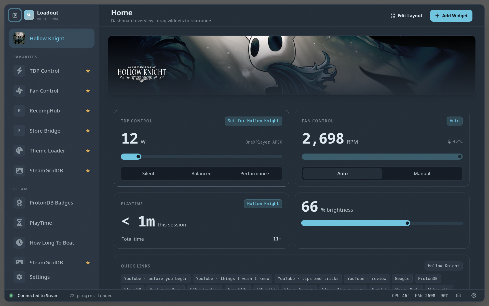
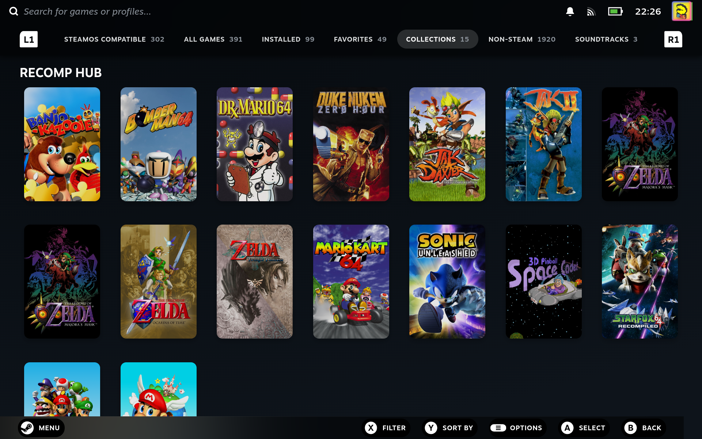
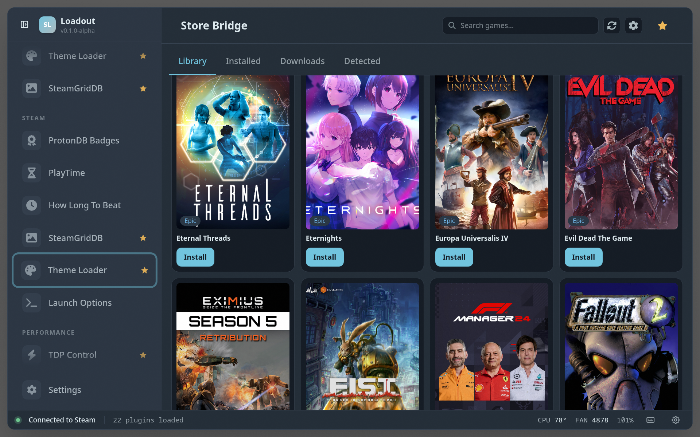
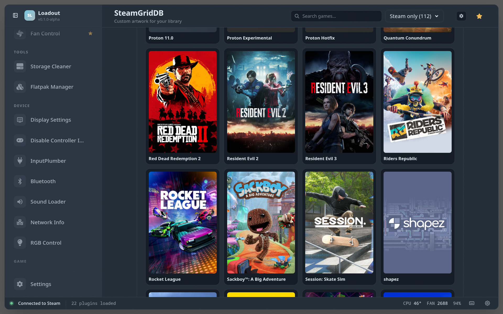
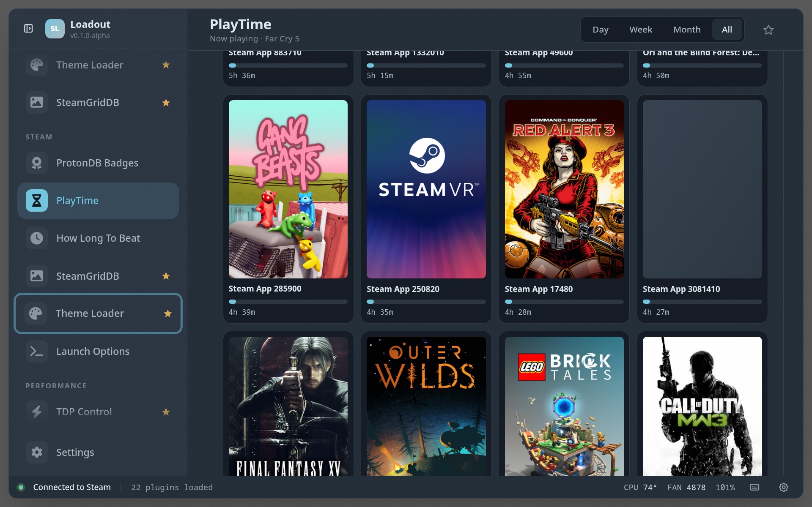
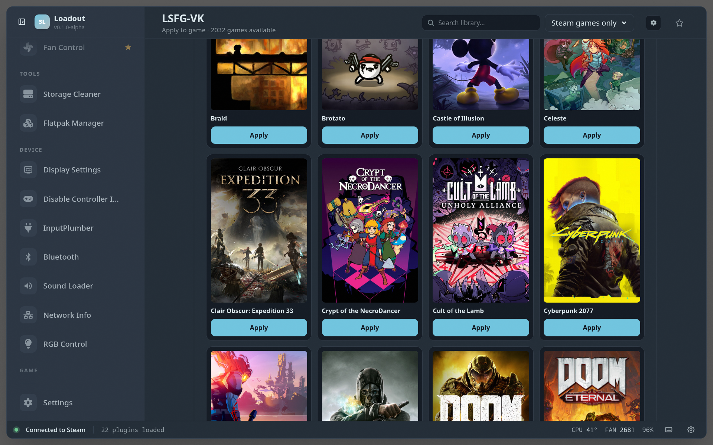

# Loadout

> **One overlay. Every tweak your handheld was missing.** A fast, beautiful
> plugin platform and in-game overlay for Linux gaming handhelds — built
> end-to-end in TypeScript.



**Tune your handheld without ever leaving your game.** Tap the overlay, dial in
your TDP, set a custom fan curve, check if a game runs well on Proton, launch
your Epic library, install a recompiled N64 classic — then get straight back to
playing. Twenty-plus plugins, one slick d-pad-friendly overlay.

[**Install →**](#install) · [Plugins](#plugins) · [Supported devices](#supported-devices--testing) · [Build from source](#build-from-source)

> 🚧 **Status: pre-launch.** Developed and tested on OneXPlayer devices and
> Valve's Steam Deck — and I'm [looking for testers](#supported-devices--testing)
> on other handhelds.

## ✨ Highlights

The greatest hits — and there are [a dozen more](#all-plugins) below:

- 🕹️ **[RecompHub](plugins/recomp/README.md)** — Browse, install, and play
  natively-recompiled classics (Zelda 64, Mario 64, and friends). No emulator,
  one tap to play.
- 🛒 **[Store Bridge](plugins/store-bridge/README.md)** — Your Epic Games
  library, installed and launchable right alongside your Steam games.
- 🖼️ **[SteamGridDB](plugins/steamgriddb/README.md)** — Gorgeous custom box
  art, heroes, and logos for every game in your library.
- ⚡ **[LSFG-VK](plugins/lsfg-vk/README.md)** — Lossless Scaling frame
  generation as a Vulkan layer — more FPS, one toggle.
- 🟢 **[ProtonDB Badges](plugins/protondb-badges/README.md)** — "Will it run?"
  answered at a glance with a compatibility tier on every game tile.
- 🔋 **[TDP](plugins/tdp-control/README.md)** & **[Fan
  Control](plugins/fan-control/README.md)** — Find your perfect
  battery-vs-performance balance with presets and live curves.
- 🎨 **[Theme Loader](plugins/theme-loader/README.md)** & **[Sound
  Loader](plugins/sound-loader/README.md)** — Reskin Big Picture with community
  CSS themes and UI sound packs.
- ⏱️ **[HowLongToBeat](plugins/hltb/README.md)** & **[PlayTime](plugins/playtime/README.md)** —
  Know what you're signing up for, and where your hours actually go.

## In Gaming Mode

Plugins reach right into Steam's Big Picture UI — themed, badged, and native:

**[RecompHub](plugins/recomp/README.md)** turns recompiled classics into native
Steam entries with full artwork — a dedicated collection in your library:



**[Theme Loader](plugins/theme-loader/README.md)** restyles the whole interface
with community CSS themes:


## Supported devices & testing

**Loadout is Linux-only by design** — it targets distros that ship Steam Gaming
Mode. No Windows or macOS build.

| OS | Status |
|---|---|
| **SteamOS** (Steam Deck) | ✅ Supported |
| **Bazzite** | ✅ Supported |
| **CachyOS** | ✅ Supported |

**Hardware tested so far:**

| Device | Status |
|---|---|
| OneXPlayer APEX | ✅ Daily-driven |
| Steam Deck | ✅ Tested |
| OneXPlayer F1 Pro | ✅ Tested |

> 🙋 **Got a different handheld?** ROG Ally, Legion Go, OneXPlayer, GPD, AYANEO,
> AOKZOE — I'd love your help. **I'm actively looking for testers on other
> devices.** [Open an issue](https://github.com/srsholmes/loadout/issues) with
> your hardware and let's get Loadout running on it.

See [docs/os-compatibility.md](docs/os-compatibility.md) for per-distro notes
(including the bundled-glibc caveat on stock SteamOS).

## Install

One command — downloads the prebuilt binary + overlay, verifies SHA-256, and
sets up the services. The backend installs as a **system** service (one `sudo`
prompt at install) so plugins can touch hardware without prompting you again;
the overlay runs as your **user**:

```sh
curl -fsSL https://raw.githubusercontent.com/srsholmes/loadout/main/scripts/install.sh | sh
```

Then open the overlay from Gaming Mode and you're set. To remove it:

```sh
curl -fsSL https://raw.githubusercontent.com/srsholmes/loadout/main/scripts/uninstall.sh | sh
```

<details>
<summary>Details & requirements</summary>

The installer downloads the prebuilt `loadout` binary + Electrobun overlay
into `~/.local/share/loadout/` and `~/.local/share/loadout-overlay/`, verifies
SHA-256 against the release's `SHA256SUMS`, and writes the systemd units: a
**system** `loadout.service` (the backend, runs as root — hence the one-time
`sudo`) and a **user** `loadout-overlay.service`. See
[docs/install-locations.md](docs/install-locations.md) for exact paths.

Runtime requirements: an X11/Xwayland display, membership in the `input` group
(so the overlay can grab evdev devices), and a working Steam install. The CEF
libraries ship inside the overlay archive.

On **SteamOS** the installer additionally builds a small `libwebkit2gtk-4.1`
library closure (the overlay's native wrapper dlopens it) from a Fedora
container via `podman` — shipped in SteamOS Holo 3.7+ — the first time, then
caches it. This is kept out of the download on purpose so the release stays
small; Bazzite/CachyOS/Fedora already provide these libraries and skip the step
entirely.

> If this repository is private, the install command will 404 until it's made
> public; `install.sh` honours a `GITHUB_TOKEN` env var for authenticated
> installs.

</details>

## FAQ

**How do I open the overlay?**
From Gaming Mode, trigger your configured wake shortcut on the controller. If
you're on a keyboard (or your controller shortcut isn't working yet),
**`Ctrl+4`** toggles the overlay open and closed at any time — handy as a
fallback during first-time setup.

**What should I do the first time I launch it?**
First-time setup is much smoother with a **keyboard attached**. You'll be
entering a few values (like a SteamGridDB API key) and configuring shortcuts,
and typing those on a keyboard is far quicker than the on-screen keyboard. Once
you're set up, day-to-day use is fully controller- and d-pad-friendly.

**Do I need a SteamGridDB API key?**
It's **highly encouraged.** The [SteamGridDB](plugins/steamgriddb/README.md)
plugin — and the custom artwork that other plugins pull in (box art, heroes,
logos) — needs a free API key to fetch art. Grab one from
[steamgriddb.com/profile/preferences/api](https://www.steamgriddb.com/profile/preferences/api)
and paste it into the SteamGridDB plugin's settings; you only enter it once and
it persists across reinstalls.

## How it works

- **TypeScript end to end.** The plugin host, every plugin backend, every
  plugin UI, and the overlay itself run on [Bun](https://bun.sh). A full
  plugin — backend + UI — is typically 150–300 lines.
- **Our own overlay surface.** A standalone CEF window layered over Gamescope
  via X11 atoms — not an injected panel, so Steam redesigns don't break it.
- **Injection only when you want it.** Plugins *can* reach into Big Picture via
  CEF's remote-debug protocol (badges, theming) — but it's opt-in, not the
  default path.
- **Batteries-included SDK.** `@loadout/ui` gives plugin authors typed RPC,
  themed React components, gamepad-aware spatial navigation, and persistent
  settings out of the box.

<details>
<summary>Build from source &amp; develop</summary>

### Build from source

```sh
git clone https://github.com/srsholmes/loadout
cd loadout
bun install
bun run build-and-install    # compile + install to ~/.local/share/, enable services
```

### Developing

The overlay ships a **patched Electrobun native wrapper** (see
[`apps/loadout-overlay/vendor/README.md`](apps/loadout-overlay/vendor/README.md))
that fixes a 100% CPU spin in CEF's browser process. The build and install
scripts swap it in automatically — but `electrobun dev` does not, so the
**dev-mode overlay runs the stock wrapper and pins a CPU core**.

**Recommended — build and install to see accurate results.** This is the only
workflow that matches what users actually run: the patched wrapper, the real
systemd user units, and production CEF flags. Re-run it after each change:

```sh
bun run build-and-install               # compile + install + enable services
systemctl --user restart loadout-overlay   # restart the overlay to pick up the build
journalctl --user -u loadout-overlay -f    # follow overlay logs
```

CEF DevTools are at `http://localhost:9222` (attach any Chromium or use CDP).

**Fast UI iteration (hot reload).** For quick webview/React work where the
native runtime doesn't matter, `bun run dev:overlay` starts the loader dev
server + Electrobun with live reload:

```sh
bun run dev:overlay
```

Caveat: dev mode uses the **stock** native wrapper, so expect a busy CPU core
and none of the patched-wrapper behaviour. Always confirm a change with
`build-and-install` before trusting it.

</details>

## Plugins

Twenty-plus and counting — every one TypeScript end-to-end. The screenshots below
are captured live from the running overlay, so they always match the current
build.

### Featured

<!-- PLUGINS_FEATURED_START — generated by scripts/scaffold-plugin-readmes.ts -->

#### [RecompHub](plugins/recomp/README.md)

Browse, install, and play recompiled retro games natively


#### [Store Bridge](plugins/store-bridge/README.md)

Surface your Epic Games library as Steam shortcuts (GOG, Amazon, Ubisoft, xCloud planned)



#### [SteamGridDB](plugins/steamgriddb/README.md)

Browse and apply custom game art (grids, heroes, logos, icons) from SteamGridDB



#### [Theme Loader](plugins/theme-loader/README.md)

Browse, install, and toggle community CSS themes for Steam's Big Picture UI


#### [HLTB](plugins/hltb/README.md)

Injects HowLongToBeat completion times into Steam library and store pages


#### [ProtonDB Badges](plugins/protondb-badges/README.md)

Shows ProtonDB compatibility ratings for your Steam library — tier badges on every game tile, plus per-game detail in the home widget.


#### [PlayTime](plugins/playtime/README.md)

Track time spent playing games, including non-Steam games



#### [LSFG-VK](plugins/lsfg-vk/README.md)

Install and configure the LSFG-VK Vulkan frame generation layer



<!-- PLUGINS_FEATURED_END -->

### All plugins

<!-- PLUGINS_GALLERY_START — generated by scripts/scaffold-plugin-readmes.ts -->

- **[Battery Tracker](plugins/battery-tracker/README.md)** — Battery level, charge rate, estimated time remaining, and charge history
- **[Bluetooth](plugins/bluetooth/README.md)** — Quick connect/disconnect paired Bluetooth devices without leaving the game
- **[Disable Controller Input](plugins/disable-controller-input/README.md)** — Silence individual controllers by telling InputPlumber to drop their virtual targets — useful for handhelds where the built-in pad is hogging player 1
- **[Display Settings](plugins/display-settings/README.md)** — Adjust display brightness and saturation
- **[Fan Control](plugins/fan-control/README.md)** — Monitor and control fan speed, temperature, and fan curve presets
- **[Flatpak Manager](plugins/flatpak-manager/README.md)** — Manage and update Flatpak applications without leaving your game
- **[HLTB](plugins/hltb/README.md)** — Injects HowLongToBeat completion times into Steam library and store pages
- **[InputPlumber](plugins/input-plumber/README.md)** — Install the InputPlumber input-routing daemon — no-op if a system package or a previous run already installed it
- **[Launch Options](plugins/launch-options/README.md)** — Manage Steam game launch options and presets
- **[LSFG-VK](plugins/lsfg-vk/README.md)** — Install and configure the LSFG-VK Vulkan frame generation layer
- **[Network Info](plugins/network-info/README.md)** — Network information, WiFi details, and Cloudflare speed test
- **[PlayTime](plugins/playtime/README.md)** — Track time spent playing games, including non-Steam games
- **[ProtonDB Badges](plugins/protondb-badges/README.md)** — Shows ProtonDB compatibility ratings for your Steam library — tier badges on every game tile, plus per-game detail in the home widget.
- **[Quick Links](plugins/quick-links/README.md)** — Open YouTube guides, ProtonDB, wikis and more for the game you're playing
- **[RecompHub](plugins/recomp/README.md)** — Browse, install, and play recompiled retro games natively
- **[RGB Control](plugins/rgb-control/README.md)** — RGB LED control for Linux handhelds — supports OpenRGB, sysfs LEDs, and platform-specific interfaces
- **[Sound Loader](plugins/sound-loader/README.md)** — Browse, install, and toggle community UI sound packs from deckthemes.com
- **[SteamGridDB](plugins/steamgriddb/README.md)** — Browse and apply custom game art (grids, heroes, logos, icons) from SteamGridDB
- **[Storage Cleaner](plugins/storage-cleaner/README.md)** — Shows disk usage, shader cache sizes, and lets users clean up space
- **[Store Bridge](plugins/store-bridge/README.md)** — Surface your Epic Games library as Steam shortcuts (GOG, Amazon, Ubisoft, xCloud planned)
- **[TDP Control](plugins/tdp-control/README.md)** — Adjust CPU/APU TDP wattage with presets and a slider
- **[Theme Loader](plugins/theme-loader/README.md)** — Browse, install, and toggle community CSS themes for Steam's Big Picture UI

<!-- PLUGINS_GALLERY_END -->

## Plugin model

A plugin is a directory under `plugins/` with a `package.json` (carrying a
`plugin` field — the manifest), an optional `backend.ts` (a `PluginBackend`
class exposing RPC methods), and an `app.tsx` UI entry that renders in the
overlay. Plugins that want to reach into Steam's own Big Picture UI (badges,
CSS) drive it from their backend via `@loadout/steam-cdp`. See
[docs/plugin-development.md](docs/plugin-development.md) for the full API.

## Architecture

The overlay is an Electrobun (CEF) app at `apps/loadout-overlay/`: `src/bun/`
is the Bun + libc-FFI main process (the evdev read loop, `EVIOCGRAB`/`EVIOCSMASK`,
Gamescope X11 atoms, NavController, and the typed RPC surface the webview talks
to); `src/webview/` is the CEF UI boot shim that pulls in the shared React tree
from `src/overlay/`. The Bun loader + CLI lives in `apps/loadout/`. See
[docs/architecture.md](docs/architecture.md) and
[docs/overlay-gamescope-integration.md](docs/overlay-gamescope-integration.md).

```
loadout/
├── apps/
│   ├── loadout/              # Bun loader + CLI: HTTP/WS server, plugin manager, Steam injector
│   └── loadout-overlay/      # Electrobun (CEF) overlay
│       ├── src/bun/          #   Bun + libc-FFI main process (evdev, Gamescope atoms, RPC)
│       ├── src/overlay/      #   Shared React tree (App, plugin host, sidebar, Settings)
│       └── src/webview/      #   CEF UI boot shim
├── packages/
│   ├── types/                # Shared interfaces (PluginBackend, RPC protocol)
│   ├── ui/                   # @loadout/ui — React SDK + useBackend + spatial nav
│   ├── exec/                 # Subprocess helpers (command allow-list)
│   ├── steam-paths/          # Steam install discovery
│   ├── steam-cdp/            # Chrome DevTools Protocol client (Steam CEF :8080)
│   ├── steam-cef-badges/     # CEF remote-debug injection into Steam Big Picture
│   ├── steam-shortcut/       # Steam shortcut writing
│   ├── vdf/                  # Valve VDF parser
│   ├── sgdb-art/             # SteamGridDB artwork fetch
│   ├── game-library/         # Game library helpers
│   ├── per-game-profiles/    # Per-game profile storage
│   ├── plugin-storage/       # Plugin state persistence
│   ├── external-cache/       # XDG cache helpers
│   ├── file-picker/          # File picker
│   └── deck-hid/             # HID device access
├── plugins/                  # The plugin suite (one dir per plugin)
├── scripts/                  # Build/install + screenshot & README tooling
└── docs/                     # Architecture, plugin dev, Steam injection, …
```

## Scripts

| Command | Description |
|---|---|
| `bun run dev:overlay` | Loader dev server + Electrobun overlay with hot reload |
| `bun run build` | Compile loader binary + Electrobun overlay tree |
| `bun run build-and-install` | `build` + install into `~/.local/share/` and enable services |
| `bun run typecheck` | `tsc --noEmit` |
| `bun run test` | Backend + UI tests |
| `bun run lint` / `bun run format` | ESLint 9 flat config / Prettier |

> **CI:** every pull request and every push to `main` runs the full
> typecheck / lint / test suite ([`.github/workflows/ci.yml`](.github/workflows/ci.yml)).
> Releases are cut manually via `workflow_dispatch`
> ([`.github/workflows/release.yml`](.github/workflows/release.yml)).

## Persistent user config

User settings — theme, UI scale, favourites, home dashboard layout, controller
shortcuts, per-plugin state — live in `~/.config/loadout/config.json`
(honouring `$XDG_CONFIG_HOME`) and survive reinstalls and CEF profile wipes.

## Tech stack

- **Runtime:** [Bun](https://bun.sh) — TypeScript execution + `bun build --compile` single-binary distribution.
- **Overlay host:** [Electrobun](https://electrobun.dev) — CEF with Bun as the main process.
- **UI:** React 18 + Tailwind v4 + daisyUI.
- **Spatial navigation:** `@noriginmedia/norigin-spatial-navigation`.
- **Service:** a system unit `loadout.service` (backend, runs as root) + a user unit `loadout-overlay.service` (overlay).

## Documentation

| Document | Description |
|---|---|
| [Architecture](docs/architecture.md) | Loader architecture, plugin structure, startup sequence |
| [Plugin Development](docs/plugin-development.md) | Plugin structure, backend/frontend APIs, examples |
| [Steam UI Injection](docs/steam-ui-injection.md) | Injectable surfaces, SteamClient API, Gamescope notes |
| [Overlay / Gamescope](docs/overlay-gamescope-integration.md) | X11 atoms, input grab, display detection |
| [Gamepad Navigation](docs/gamepad-navigation-guide.md) | Spatial navigation, focus management |
| [OS Compatibility](docs/os-compatibility.md) | SteamOS, Bazzite, CachyOS specifics |

## Thanks & acknowledgements

Loadout stands on the shoulders of giants. It would not be anywhere near as good
as it is without the people and projects below — please go star their work.

**A huge thank-you to the [Decky Loader](https://github.com/SteamDeckHomebrew/decky-loader)
community.** Years of hard work on the Linux handheld homebrew ecosystem — and
the incredible plugins built on top of it — paved the way for everything here
and continue to inspire it. 💛

The platform is built on:

- [Bun](https://bun.sh) — the TypeScript runtime + single-binary compiler.
- [Electrobun](https://electrobun.dev) — CEF with Bun as the main process.
- [React](https://react.dev), [Tailwind CSS](https://tailwindcss.com),
  [daisyUI](https://daisyui.com) — the UI stack.
- [norigin-spatial-navigation](https://github.com/NoriginMedia/Norigin-Spatial-Navigation)
  — gamepad-friendly focus.

And many plugins are thin, grateful wrappers around brilliant upstream projects:

- [SteamGridDB](https://www.steamgriddb.com) — community game artwork.
- [ProtonDB](https://www.protondb.com) — Proton compatibility ratings.
- [HowLongToBeat](https://howlongtobeat.com) — game-length data.
- [legendary](https://github.com/derrod/legendary) — the open-source Epic Games
  launcher behind Store Bridge.
- [lsfg-vk](https://github.com/PancakeTAS/lsfg-vk) &
  [decky-lsfg-vk](https://github.com/xXJSONDeruloXx/decky-lsfg-vk) — Lossless
  Scaling frame generation as a Vulkan layer.
- [RyzenAdj](https://github.com/FlyGoat/RyzenAdj) — TDP control.
- [InputPlumber](https://github.com/ShadowBlip/InputPlumber) — input routing.
- [OpenRGB](https://openrgb.org) — RGB LED control.
- [DeckThemes](https://deckthemes.com) &
  [CSS Loader](https://github.com/DeckThemes/SDH-CssLoader) — community themes
  and UI sound packs.
- The N64/PC recompilation community ([N64: Recompiled](https://github.com/N64Recomp/N64Recomp),
  [OpenGOAL](https://opengoal.dev), and friends) behind RecompHub.

Built something Loadout relies on and not listed here? Open a PR — we want to
credit you.

## License

BSD 3-Clause — see [LICENSE](LICENSE), [NOTICE](NOTICE), and
[THIRD_PARTY_LICENSES.md](THIRD_PARTY_LICENSES.md).
