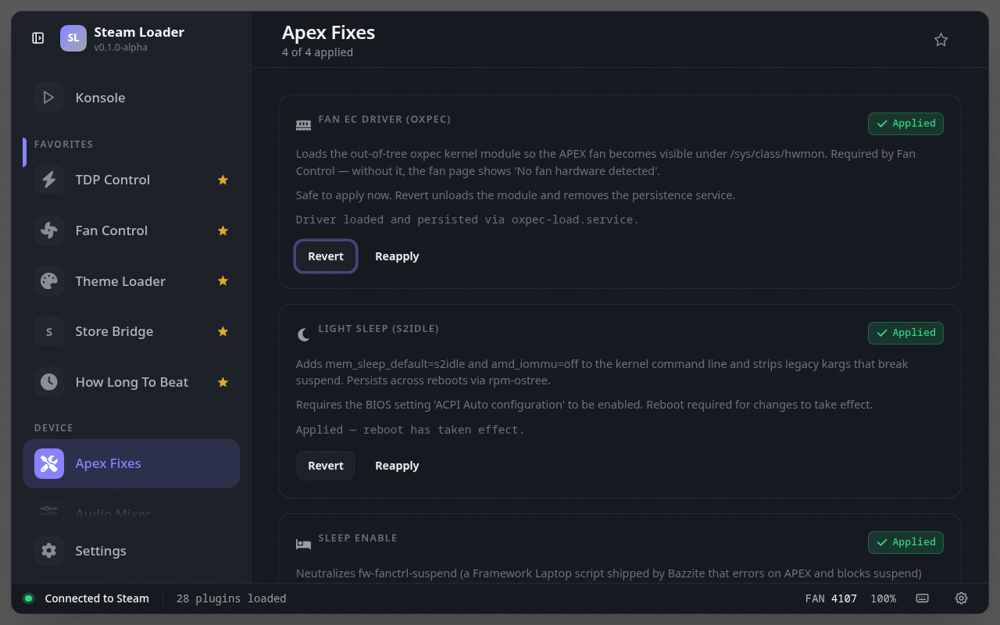

# Apex Fixes

> Device-specific workarounds for the OneXPlayer APEX — oxpec EC sensor driver, sleep/wake fixes, and gamepad USB recovery

## See also

- [All plugins](../../README.md#plugins)
- [Plugin model](../../README.md#plugin-model)
