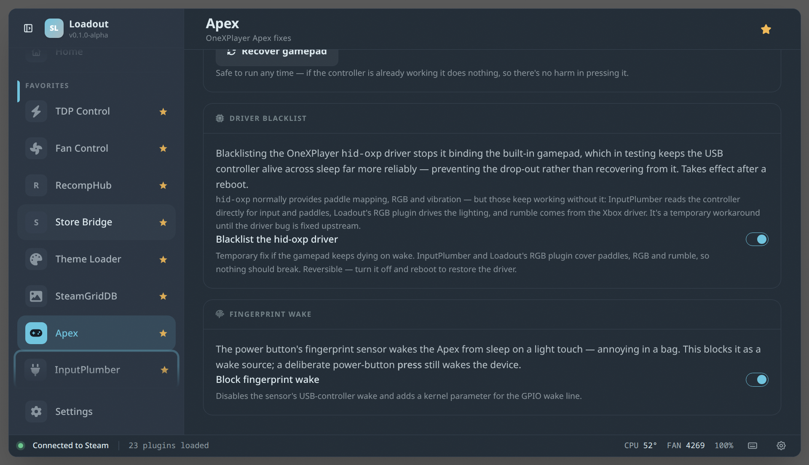

# Apex

> OneXPlayer Apex device fixes: recover the internal gamepad when its xHCI controller dies on resume (or blacklist the hid-oxp driver to prevent the drop-out), and block the fingerprint reader from waking the device on a light touch.

## Screenshots



The plugin is DMI-gated — on any non-Apex device it renders an inert "not on Apex" banner and never touches hardware.

## Gamepad recovery

On the OneXPlayer Apex the xHCI USB host controller (`0000:65:00.4`) can die when the device wakes from sleep:

```
xhci_hcd 0000:65:00.4: xHCI host controller not responding, assume dead
xhci_hcd 0000:65:00.4: HC died; cleaning up
usb 1-1: USB disconnect ...
```

That drops the built-in gamepad (`1a86:fe00` HID MCU + `045e:028e` Xbox 360 pad) clean off the USB bus, so the controller looks dead and restarting InputPlumber doesn't help — there's no source device left to grab. The **Recover gamepad** button unbinds and rebinds the PCI controller so the whole bus re-enumerates and the pad comes back; it then re-grabs InputPlumber to pick up the freshly enumerated source. That re-grab is delegated to the InputPlumber plugin so the wake-button profile is reloaded too — a plain `systemctl restart inputplumber` would drop it.

The same logic is also available as a standalone shell script for use outside Loadout: [`scripts/fix-controller-resume.sh`](../../scripts/fix-controller-resume.sh).

## Driver blacklist (hid-oxp)

Blacklisting the OneXPlayer `hid-oxp` driver stops it binding the built-in gamepad, which in testing keeps the USB controller alive across sleep far more reliably — preventing the wake drop-out rather than recovering from it. Takes effect after a reboot.

`hid-oxp` normally provides paddle mapping, RGB, and vibration, but those keep working without it: InputPlumber reads the controller directly for input and paddles, Loadout's RGB plugin drives the lighting via hidraw, and rumble comes from the Xbox driver. It's a **temporary workaround** until the driver bug is fixed upstream — the toggle is opt-in and reversible (turn it off and reboot to restore the driver).

## Fingerprint wake

The power button's fingerprint sensor wakes the Apex from sleep on a light touch — annoying in a bag. The **Block fingerprint wake** toggle disables it as a wake source (controller PME at runtime + a GPIO kernel argument); a deliberate power-button press still wakes the device. The kernel-arg change needs a reboot, and on non-SteamOS distros the GPIO arg may need to be added manually (the panel shows the exact arg).

## See also

- [All plugins](../../README.md#plugins)
- [Plugin model](../../README.md#plugin-model)
