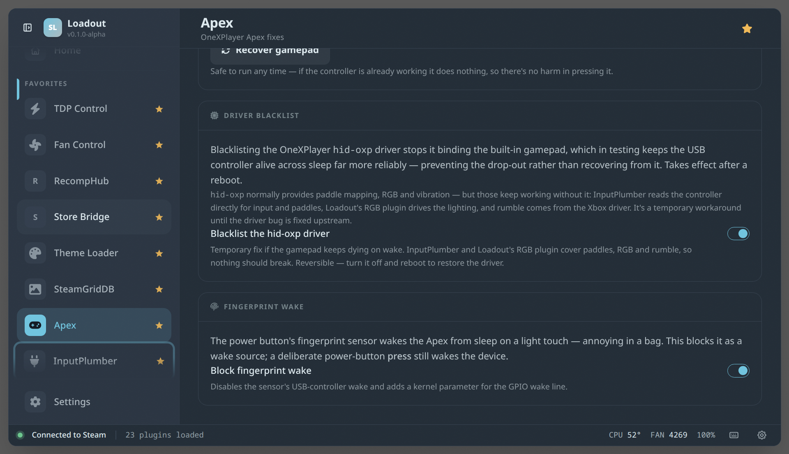

# OneXPlayer

> OneXPlayer device fixes: recover the internal gamepad when its xHCI controller dies on resume, and block the fingerprint reader from waking the device on a light touch.

## Screenshots



The plugin runs on any OneXPlayer-family handheld and detects each feature's
hardware for itself — the fingerprint reader by USB id, the dead xHCI controller
from the kernel log. It was gated to the Apex alone until an X2 Mini Pro owner
reported being locked out of fixes their hardware could use.

Two things stay Apex-specific, because they are board wiring rather than family
behaviour, and both degrade rather than misfire:

- **The fingerprint GPIO kernel arg** (`AMDI0030:00@58`) names a specific pin.
  On any other board it is offered as text to apply by hand; the PME wake path,
  which is derived from the reader's own PCI parent, still applies everywhere.
- **The gamepad USB ids** (`1a86:fe00`, `045e:028e`). If neither enumerates and
  the kernel log shows nothing dead, the plugin says it can't identify the pad
  rather than offering a rebind that could never report success.

The plugin id stays `apex` so existing settings survive; only the display name
changed.

## Gamepad recovery

On the OneXPlayer Apex the xHCI USB host controller (`0000:65:00.4`) can die when the device wakes from sleep:

```
xhci_hcd 0000:65:00.4: xHCI host controller not responding, assume dead
xhci_hcd 0000:65:00.4: HC died; cleaning up
usb 1-1: USB disconnect ...
```

That drops the built-in gamepad (`1a86:fe00` HID MCU + `045e:028e` Xbox 360 pad) clean off the USB bus, so the controller looks dead and restarting InputPlumber doesn't help — there's no source device left to grab. The **Recover gamepad** button unbinds and rebinds the PCI controller so the whole bus re-enumerates and the pad comes back; it then re-grabs InputPlumber to pick up the freshly enumerated source. That re-grab is delegated to the InputPlumber plugin so the wake-button profile is reloaded too — a plain `systemctl restart inputplumber` would drop it.

The same logic is also available as a standalone shell script for use outside Loadout: [`scripts/fix-controller-resume.sh`](../../scripts/fix-controller-resume.sh).

## The hid-oxp blacklist (removal only)

Loadout once recommended blacklisting the OneXPlayer HID driver, because it
looked implicated in the xHCI controller dying on resume. **We no longer offer
to apply it, and shouldn't again.** It disabled the driver instead of fixing
the wake bug — that's what **Recover gamepad** above is for — and `hid-oxp` is
where OneXPlayer's device controls live: rumble intensity, gamepad mode and
button remapping all disappear with it, on a machine that has no way to know
why.

What remains is a **Driver blacklist** card that appears only if the drop-in
is still on disk, offering to remove it. There is deliberately no path to
write it, in the UI or in [`lib/hid-oxp.ts`](lib/hid-oxp.ts) — a unit test
asserts the module exports no `set`/`apply`/`enable` function. If the wake bug
resurfaces, the fix belongs in [`lib/xhci.ts`](lib/xhci.ts).

## Fingerprint wake

The power button's fingerprint sensor wakes the Apex from sleep on a light touch — annoying in a bag. The **Block fingerprint wake** toggle disables it as a wake source (controller PME at runtime + a GPIO kernel argument); a deliberate power-button press still wakes the device. The kernel-arg change needs a reboot, and on non-SteamOS distros the GPIO arg may need to be added manually (the panel shows the exact arg).

## See also

- [All plugins](../../README.md#plugins)
- [Plugin model](../../README.md#plugin-model)
