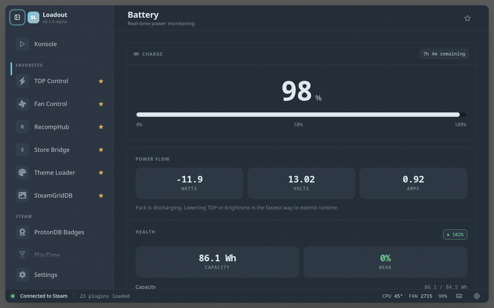

# Battery

> Battery level, charge rate, time remaining, charge history, charge limit, and bypass charging

Keeps an eye on your battery while you play — current charge, how fast it's draining or charging, estimated time left, and a short history of the session. On a handheld it answers the question that matters: will I reach a save point before I need the charger?

On supported hardware it also controls how the battery charges:

- **Charge limit** — stop charging at a set percentage (50–95%) to reduce long-term battery wear. Reapplied automatically at every service start, since some firmware forgets the threshold across reboots.
- **Bypass charging** — run from the power adapter without charging the pack, cutting heat and charge cycles during long docked sessions. On kernels that support it, an extra "While awake" mode resumes normal charging when the device sleeps.

Both controls use the kernel's standard `power_supply` interface (`charge_control_end_threshold` and `charge_behaviour`, plus the legacy OneXPlayer `charge_type` attribute), so they work on any device whose kernel driver exposes them — ROG Ally, OneXPlayer/AOKZOE, and other handhelds with mainline vendor drivers. Devices without support simply don't show the controls.

## Screenshots

## See also

- [All plugins](../../README.md#plugins)
- [Plugin model](../../README.md#plugin-model)
