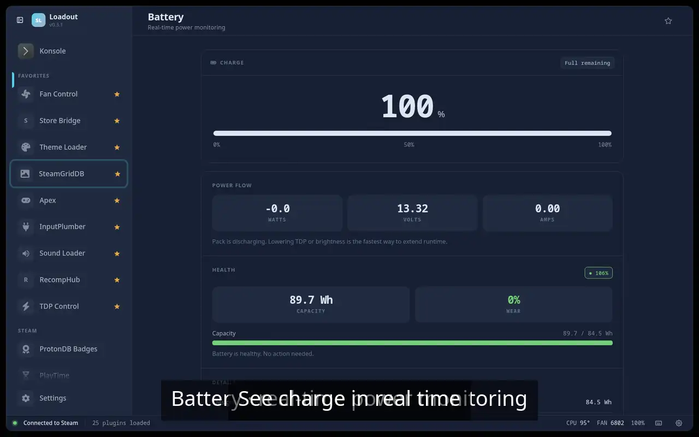

# Battery Tracker

> Battery level, charge rate, estimated time remaining, and charge history

Keeps an eye on your battery while you play — current charge, how fast it's draining or charging, estimated time left, and a short history of the session. On a handheld it answers the question that matters: will I reach a save point before I need the charger?

## Demo

## Screenshots

## See also

- [All plugins](../../README.md#plugins)
- [Plugin model](../../README.md#plugin-model)
