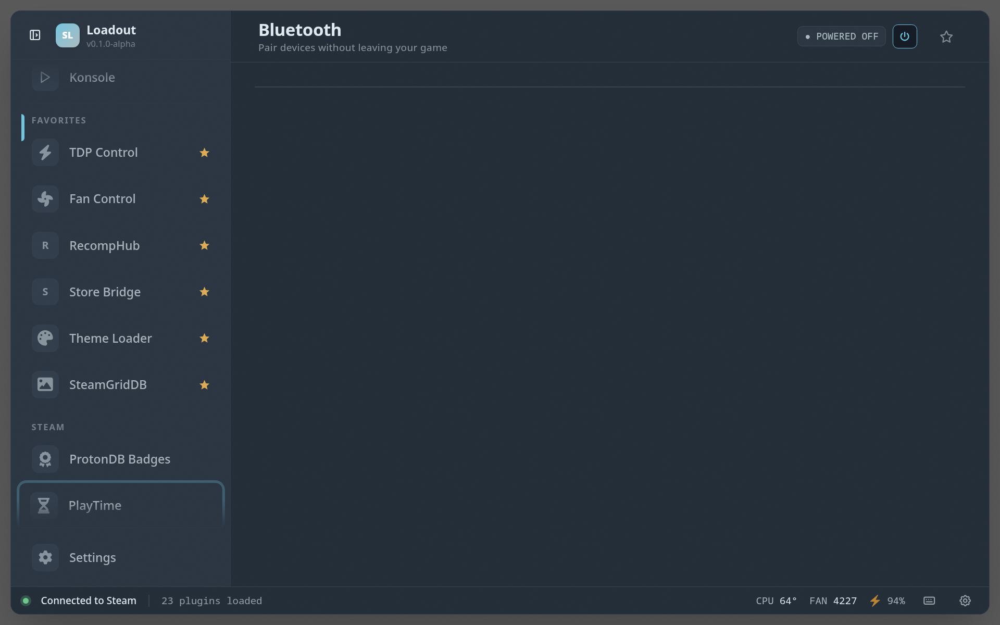

# Bluetooth

> Quick connect/disconnect paired Bluetooth devices without leaving the game

Connect, disconnect, and scan for paired Bluetooth devices straight from the overlay, so swapping to headphones or a controller never means dropping back to the desktop — handy in Gaming Mode where Steam's own Bluetooth controls are fiddly.

## Screenshots

## See also

- [All plugins](../../README.md#plugins)
- [Plugin model](../../README.md#plugin-model)
