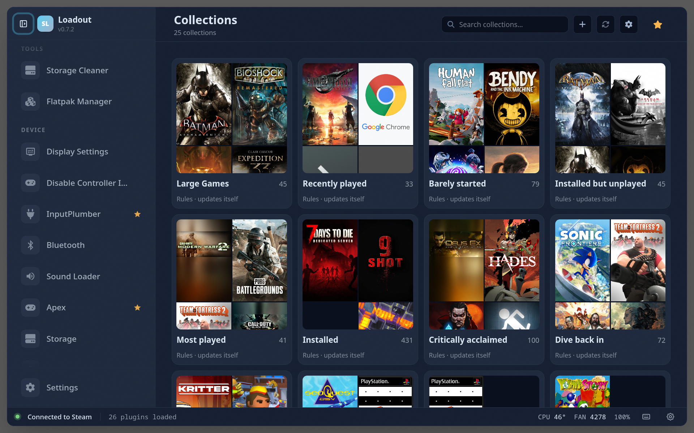
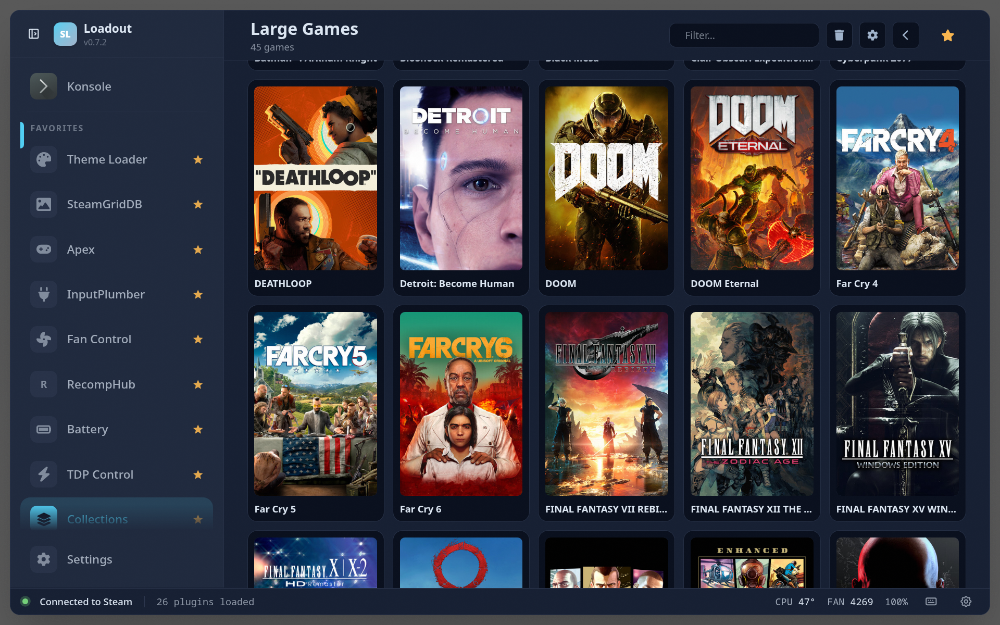
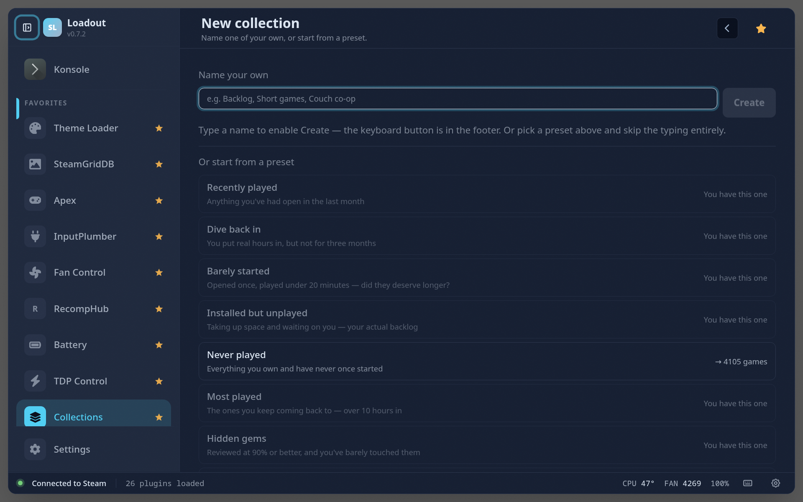
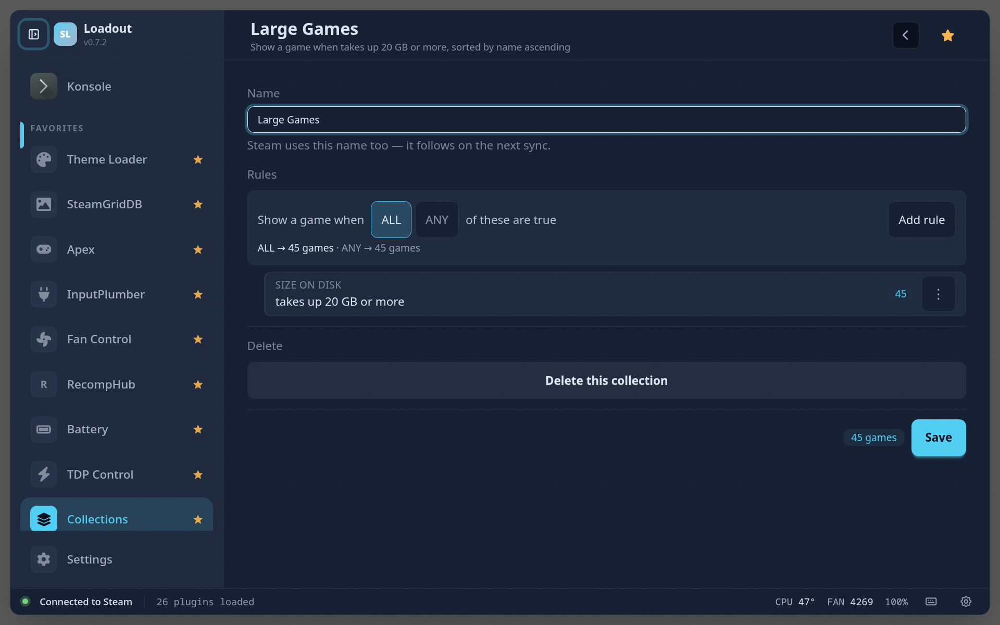
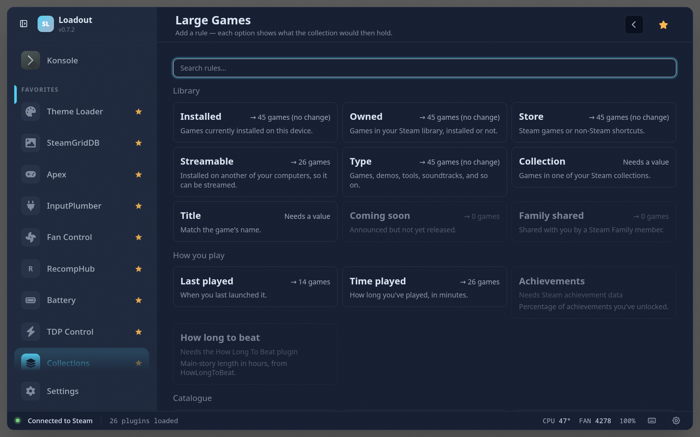
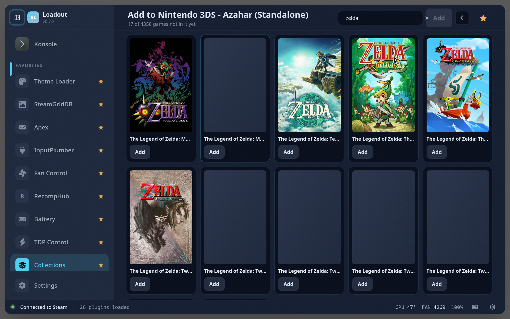

# Collections

> Manage the Steam collections you already have, and build new ones from rules that keep themselves up to date

Manages your Steam collections from the overlay — the ones you already have, and new ones built from rules. Every collection you own is on the grid, including the ROM sets EmuDeck and Steam ROM Manager create, and opening one shows exactly what Steam shows. Rule-built collections keep themselves up to date: "installed but never played", "under 20 minutes in", "over 20 GB" — each rule priced against your library before you commit to it, so you never build one that turns out to be empty. What you see is what Steam gets.

## Two kinds of collection

|  | Built from rules | Already in Steam |
|---|---|---|
| Where it came from | made here | EmuDeck, Steam ROM Manager, or your own hand |
| What's in it | whatever the rules match, re-evaluated on every sync | an explicit list of games |
| Rules | yes | **never** — pointing rules at a set somebody else curated would replace their work |
| Editing its contents | change the rules | add and remove games directly |
| Rename / delete | yes, behind a two-step confirm | yes, behind a two-step confirm |

Every rule-built collection syncs — there is no per-collection opt-in, so what
you see here is what Steam gets. The ones that already live in Steam are not
"synced" at all: they *are* Steam's, and editing one writes to it directly.

## A rule collection can drop a game, and that's the point

A collection called *"barely started"* that still lists something you have now
played for half an hour is simply wrong. What makes that jarring is silence,
not the removal — so the card says **"Rules · updates itself"** before you open
it, and a sync reports what changed by name: *"Barely started — 1 removed
(Portal 2)"*.

## Syncing

Editing a **rule-built** collection never writes to Steam on its own. A sync is
a full library evaluation plus a batch of Cloud writes, and this runs on a
handheld — doing that while you are still working made the plugin look frozen.
So it happens where nothing is waiting on it:

- the sync button in the header, whenever you want it;
- when you leave the plugin, if **Sync when I leave** is on;
- at startup, if a sync was owed from a session where Steam was closed.

A collection with no rules yet is never written — an empty rule tree matches
your whole library, and nobody wants that in Steam.

Editing a collection that is **already in Steam** is the other way round: adding
or removing games, renaming, deleting and cleaning up all write immediately,
because there is nothing to compute — Steam already holds the answer. Deleting a
rule-built collection also removes its Steam collection on the spot, rather than
leaving it there until the next sync.

## Entries Steam can no longer resolve

A Steam collection stores bare app ids, and **a non-Steam shortcut's id is
regenerated every time the shortcut is re-added**. Re-run EmuDeck or a ROM
manager and the ids the collection holds for those entries go dead. Steam
quietly skips them, which is why a collection can read as 221 games in one
place and 16 in another.

Opening one shows what resolves and counts the rest, with a two-step **Clean
up** that drops the dead ids. It refuses to run while the library is still
loading — everything looks dead then, and confirming it would empty a
collection somebody else built.

## Screenshots

### Overview

### Inside a collection

### Starting a collection

### Rules

### Adding a rule

### Adding games by hand

## Notes

- **Steam's library tabs are a different thing.** This manages collections —
  the data. The tab strip along the top of Steam's library is built inline in
  Steam's own bundle rather than from data, so reaching it means patching Steam
  at runtime. That was tried: the patch applied but the tabs never rendered,
  most likely because webpack had already executed and cached the module —
  unproven, and other explanations were left unexamined. It was abandoned on
  cost rather than impossibility; collections reach the same place through a
  supported door.
- Collections Steam derives for itself (Uncategorized, Favorites, Locally
  Installed, the `type-*` sets) are left out. Steam already provides them.
- Dynamic collections — the ones Steam recomputes from a filter — are shown but
  never written to, since anything written would be undone without a word.

## See also

- [All plugins](../../README.md#plugins)
- [Plugin model](../../README.md#plugin-model)
