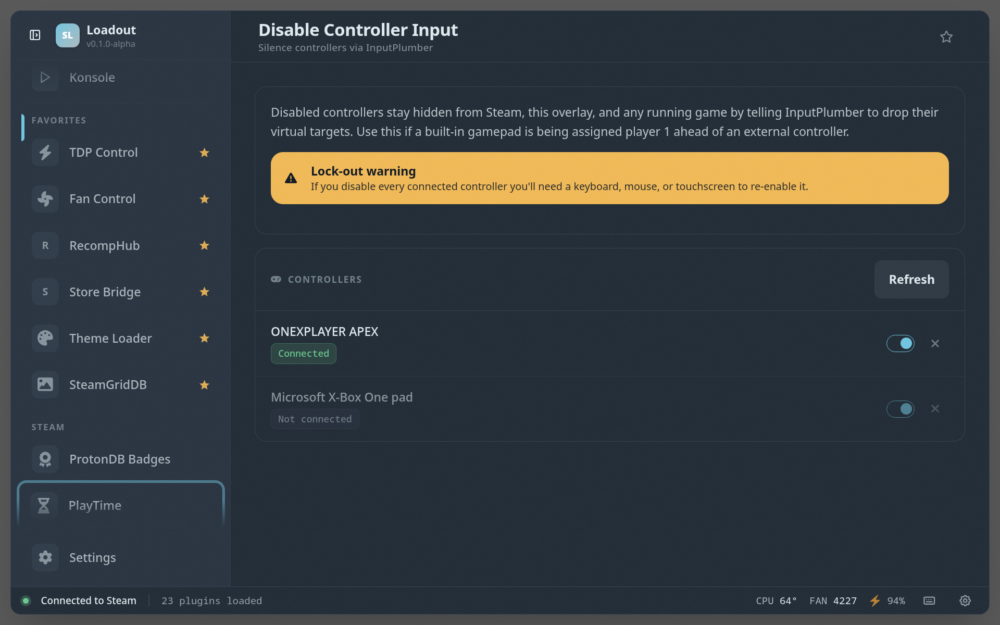

# Disable Controller Input

> Silence individual controllers by telling InputPlumber to drop their virtual targets — useful for handhelds where the built-in pad is hogging player 1

Mutes a specific controller by asking InputPlumber to drop its virtual inputs — the fix for handhelds where the built-in gamepad steals player 1 from the controller you actually want to use. Toggle a pad off without unpairing or unplugging it.

## Screenshots

## See also

- [All plugins](../../README.md#plugins)
- [Plugin model](../../README.md#plugin-model)
