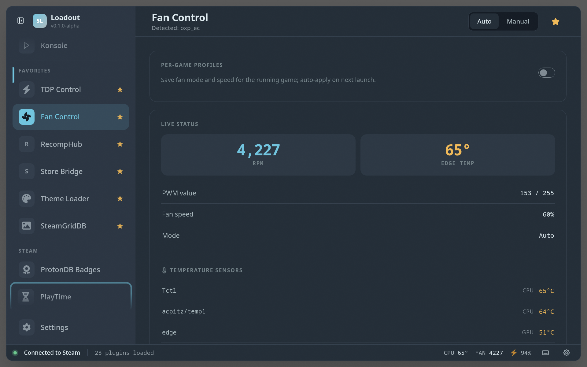

# Fan Control

> Monitor and control fan speed, temperature, and fan curve presets

Monitor temperatures and fan speed and apply fan-curve presets, trading noise for cooling on demand. Useful for keeping a handheld quiet on the couch or cooler during a long session.

## Screenshots

## See also

- [All plugins](../../README.md#plugins)
- [Plugin model](../../README.md#plugin-model)
