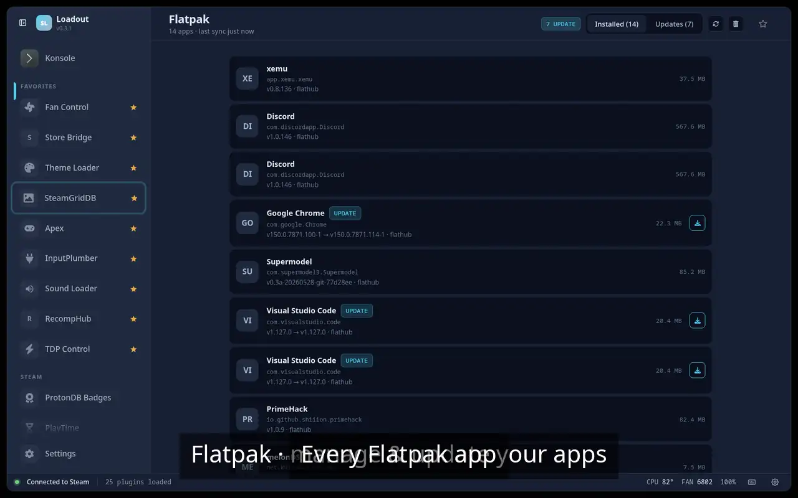

# Flatpak Manager

> Manage and update Flatpak applications without leaving your game

List and update your installed Flatpak apps without dropping to the desktop, so emulators and launchers stay current from inside Gaming Mode.

## Demo

## Screenshots

## See also

- [All plugins](../../README.md#plugins)
- [Plugin model](../../README.md#plugin-model)
