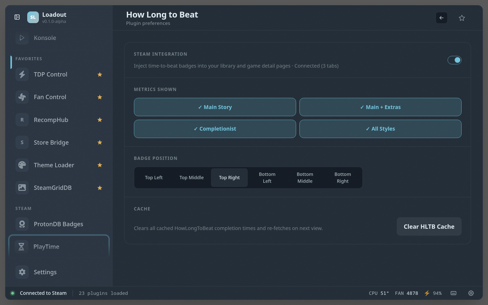

# HLTB

> Injects HowLongToBeat completion times into Steam library and store pages

Pulls HowLongToBeat completion times into Steam's library and store pages, so you can see at a glance how long a game takes to finish and pick something that fits the time you have.

## Screenshots

### Overview

### Game detail

### Settings

## See also

- [All plugins](../../README.md#plugins)
- [Plugin model](../../README.md#plugin-model)
