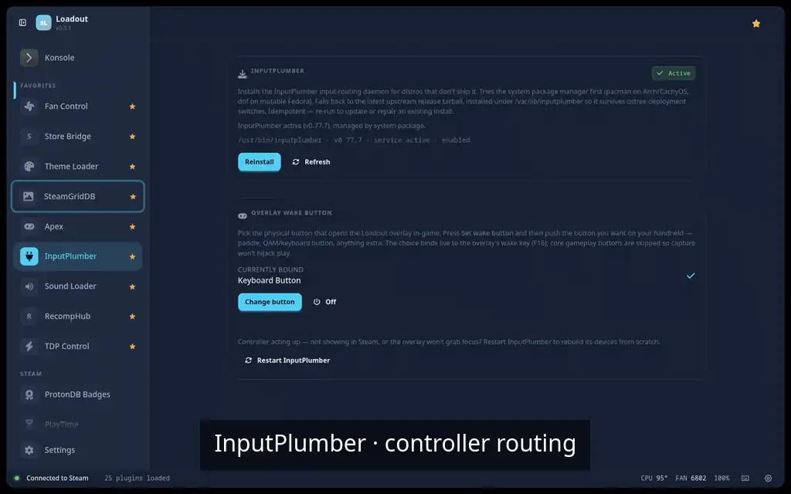
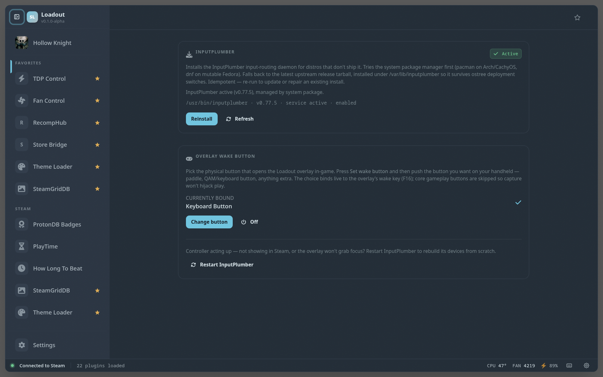

# InputPlumber

> Install the InputPlumber input-routing daemon — no-op if a system package or a previous run already installed it

Installs the InputPlumber input-routing daemon that other controller features rely on, and quietly does nothing if it's already present. Mostly a one-time setup helper so the rest 'just works'.

## Demo

## Screenshots

## See also

- [All plugins](../../README.md#plugins)
- [Plugin model](../../README.md#plugin-model)
