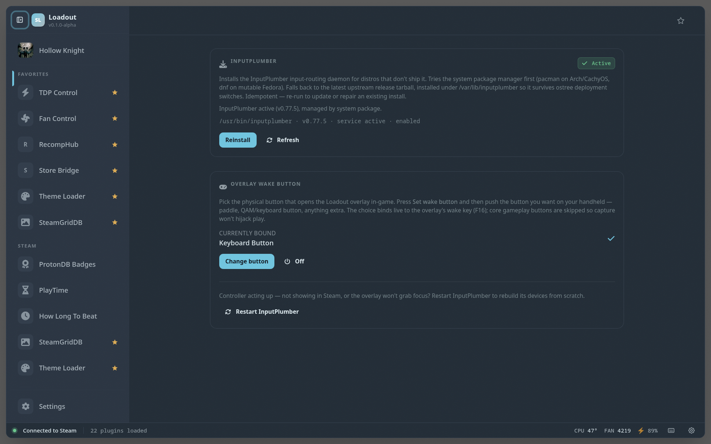

# InputPlumber

> Install the InputPlumber input-routing daemon — no-op if a system package or a previous run already installed it

Installs the InputPlumber input-routing daemon that other controller features rely on, and quietly does nothing if it's already present. Mostly a one-time setup helper so the rest 'just works'.

## Device configs

InputPlumber only builds a `CompositeDevice` for hardware one of its configs
matches, and matching is on the exact `/sys/class/dmi/id/product_name`. On a
handheld it has no config for there is no composite device at all — so the
wake-button picker lists nothing and overlay input intercept has nothing to
act on. Every InputPlumber-dependent feature is inert on hardware that is
otherwise completely conventional.

For devices we can describe, this plugin offers to drop a config into
`/etc/inputplumber/devices.d`. That directory is searched *before*
`/usr/share/inputplumber/devices`, with ties broken by basename, and the
first config matching a given source device wins — so these files use the
name upstream would use, and a same-name upstream config is shadowed rather
than loading alongside ours and matching the same machine twice.

That only holds for an *identical* basename, though, and upstream may well
pick a different one (their family runs `50-onexplayer_apex.yaml`,
`50-onexplayer_x1.yaml`, `50-onexplayer_mini_pro.yaml`). So "has upstream
caught up" is decided by reading the DMI pairs their configs claim, not by
comparing filenames — otherwise the UI would report "not superseded" in
exactly the case where both configs load and the user most needs telling.

The card only appears when InputPlumber is actually running, we have a
config for this exact machine, and it has genuinely produced no composite
devices. A device that already works is never offered one.

Currently shipped:

| Device | DMI `product_name` | Notes |
| --- | --- | --- |
| OneXPlayer X2 Mini Pro | `ONEXPLAYER X2Mini PRO` | Not in InputPlumber 0.78.1. Gamepad + MCU only. |

Note the MCU exposes two evdev nodes under one name, so its source entry
needs `unique: false` or InputPlumber forks a second CompositeDevice off the
same config — duplicate virtual pads. Upstream's Apex and X1 configs avoid
this by pinning `phys_path`; without that board's topology, joining is the
portable equivalent.

Each config is deliberately minimal — enough to make a composite device
exist, and no more. See the docblock in `lib/device-config.ts` for what is
left out and why (the system keyboard, and the back-paddle capability map).

## Screenshots

## See also

- [All plugins](../../README.md#plugins)
- [Plugin model](../../README.md#plugin-model)
