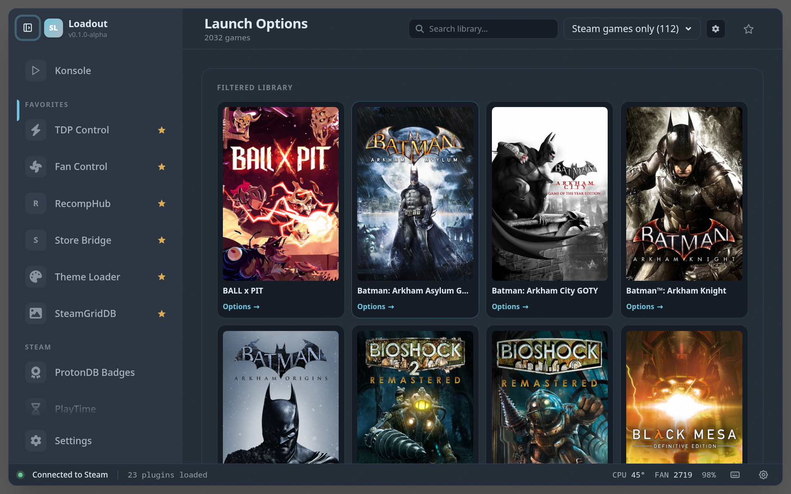
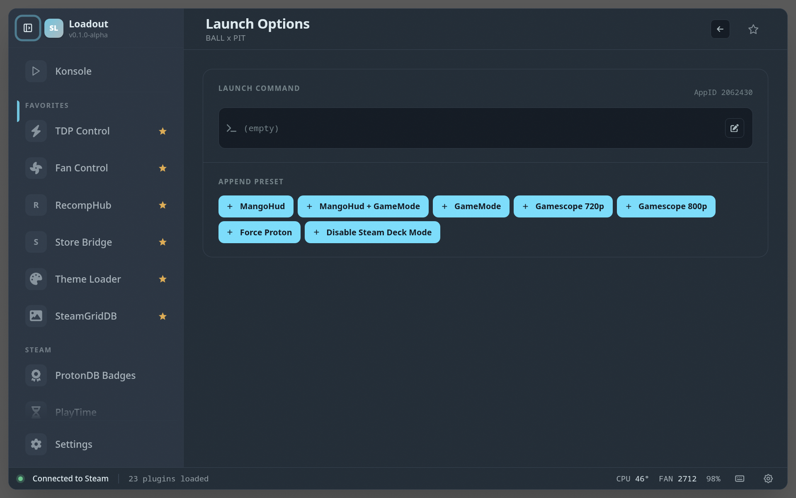
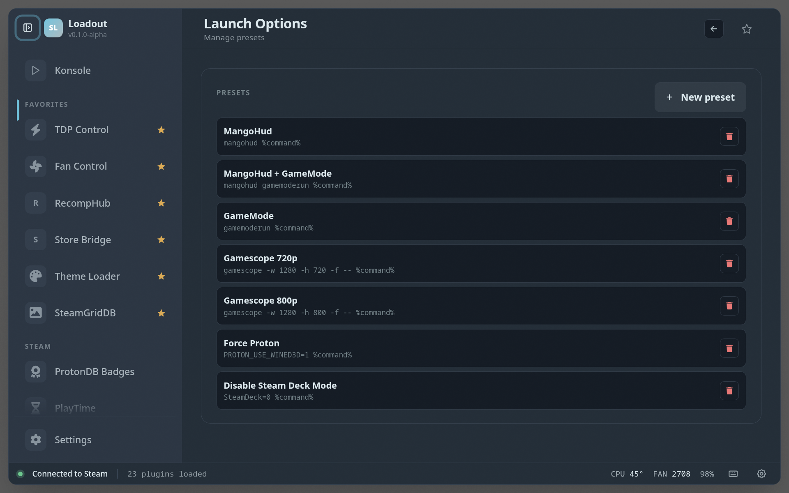

# Launch Options

> Manage Steam game launch options and presets

## Screenshots

### Overview

### Game detail

### Presets

## See also

- [All plugins](../../README.md#plugins)
- [Plugin model](../../README.md#plugin-model)
