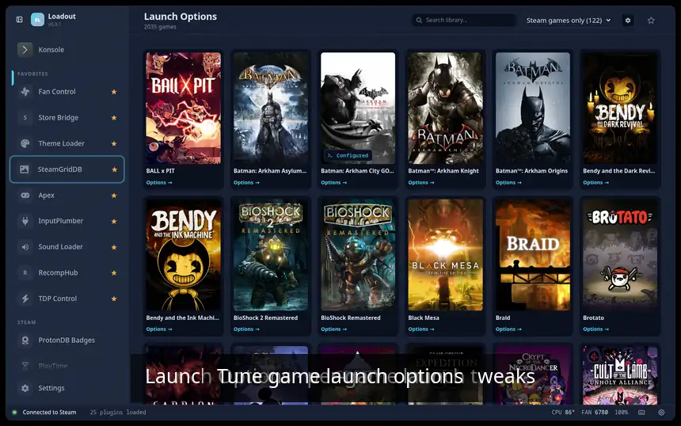

# Launch Options

> Manage Steam game launch options and presets

Edit Steam launch options per game and save reusable presets, turning common flags and environment variables into a couple of clicks instead of typed-out strings — great for applying the same tweak across many games.

## Demo

## Screenshots

### Overview

### Game detail

### Presets

## See also

- [All plugins](../../README.md#plugins)
- [Plugin model](../../README.md#plugin-model)
