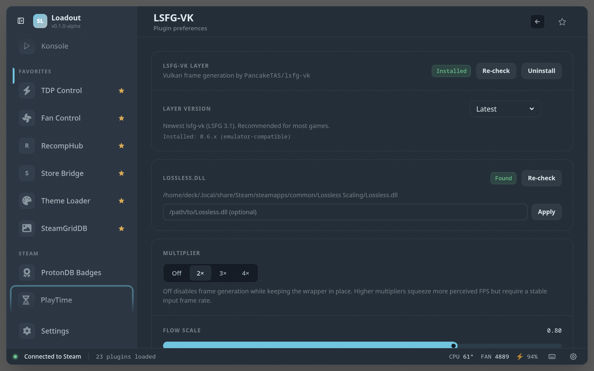

# LSFG-VK

> Install and configure the LSFG-VK Vulkan frame generation layer

Installs and configures the LSFG-VK Vulkan frame-generation layer and applies it per game, boosting perceived frame rate on titles that run below your display's refresh. Set it up once and toggle it where it actually helps.

## Screenshots

### Overview

### Settings

## See also

- [All plugins](../../README.md#plugins)
- [Plugin model](../../README.md#plugin-model)
