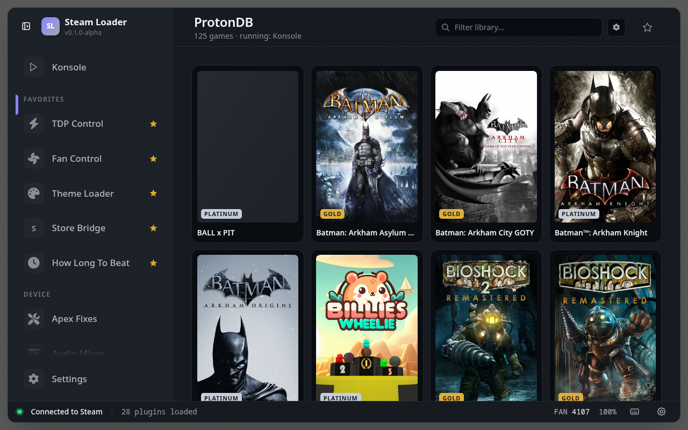

# ProtonDB Badges

> Shows ProtonDB compatibility ratings for your Steam library — tier badges on every game tile, plus per-game detail in the home widget.

## Steam-side badges

Beyond the overlay UI, the backend connects to Steam's CEF debug port over
CDP and injects a tier badge directly into Steam's Big Picture Mode game
pages and store pages (`store.steampowered.com`). The injected runtime
(`window.__protondb_badges`) is a passive renderer; the backend polls the
viewed app's route, fetches the ProtonDB report server-side, and pushes it
in. Style, position, the submit button, and the library/store toggles are
all driven from the plugin's settings.

## See also

- [All plugins](../../README.md#plugins)
- [Plugin model](../../README.md#plugin-model)
