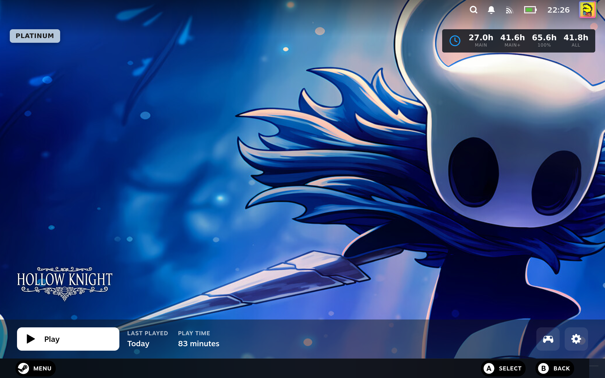

# ProtonDB Badges

> Shows ProtonDB compatibility ratings for your Steam library — tier badges on every game tile, plus per-game detail in the home widget.

Adds ProtonDB compatibility ratings to your Steam library — a tier badge on every game tile plus per-game detail in the home widget — so you know whether something is likely to run well on Linux/Proton before you install it.

## Screenshots

### Plugin

### In Big Picture

The ProtonDB tier badge (here, **Platinum**) shown right on a game page in
Gaming Mode:

## See also

- [All plugins](../../README.md#plugins)
- [Plugin model](../../README.md#plugin-model)
