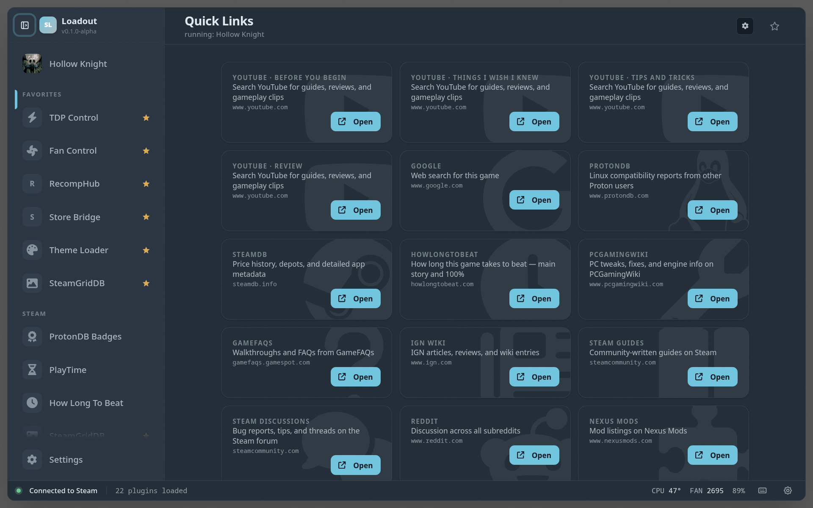

# Quick Links

Per-game contextual link launcher. Renders a card grid (landing page)
and a chip strip (home widget) of curated sites — YouTube, ProtonDB,
SteamDB, HowLongToBeat, PCGamingWiki, Steam Guides/Discussions,
Reddit, Nexus Mods, Wikipedia, IsThereAnyDeal, Metacritic,
OpenCritic, Speedrun.com, Twitch, Backloggd, GameFAQs, IGN — with
the running game's `{appId}` / `{name}` substituted into each URL
template. Clicking a card calls quick-links' own `launchUrl` backend
RPC, which opens it in the user's chosen browser shortcut.

User-added templates and per-game pins / custom links live in
plugin storage; built-ins ship in `DEFAULT_TEMPLATES` and re-seed
on every `onLoad()` so version bumps add new sites for free.

## Screenshots

## Browser shortcut management (was `gaming-mode-browser`)

Quick Links owns the "register a desktop browser as a non-Steam game"
flow that used to live in the standalone `gaming-mode-browser`
plugin. Folded in for issue #121:

- The settings page detects installed browsers (Firefox, Chrome,
  Brave, Chromium, Edge, Vivaldi — native or flatpak), lets the user
  pick one, and calls `SteamClient.Apps.AddShortcut` to register it.
- Multiple shortcuts can coexist; the "Open links in" dropdown picks
  which one Quick Links uses for new clicks.
- `launchUrl(url[, browserId])` is a cross-plugin RPC: other plugins
  (`store-bridge` etc.) call `useBackend("quick-links").call("launchUrl", url)`
  to hand a URL to the registered browser shortcut.
- A migration path reads `gaming-mode-browser`'s plugin storage at
  first onLoad so users upgrading from before #121 land keep their
  installed shortcuts without having to re-register.

A gaming-mode-only banner appears on the landing page when no
Chrome/Firefox shortcut is registered — that's the case where Quick
Links has nothing to hand URLs off to. Outside Gaming Mode (desktop
session) the banner stays hidden because the desktop browser is
already accessible directly.

## UI structure

- **Landing view** (default mount): standard `PluginHeader` portal
  with title + dynamic running-game subtitle + cog icon. Body is a
  card grid (one card per visible template, suffix-expanded). Empty
  state with a focusable "Open Settings" button when no game is
  running. Renders a warning banner when in Gaming Mode with no
  Chrome/Firefox shortcut registered.
- **Settings view** (cog → flips internal `view` state): browser
  shortcut card (pick / install / uninstall), templates, suffix
  groups, per-game pins. `HeaderBackButton` replaces the cog while in
  this view. The browser installer card auto-opens when nothing is
  installed yet.
- **Home widget** (`mountHomeWidget`): compact chip strip.

## Future: hidden-CEF search-result aggregator

Considered for v2 — deferred until the static-card UX has been
lived-with for a while. Notes for whoever picks this up:

**Architecture sketch.** Spawn a hidden Electrobun `BrowserWindow`
from the overlay's Bun main process, point it at a search URL
(DuckDuckGo HTML preferred — see anti-bot section below — or a paid
Google Programmable Search Engine), drive it via the existing
`packages/steam-cdp` `CDPClient` against `localhost:9222` (the
overlay's own CEF DevTools port, baked in by `electrobun.config.ts`),
extract result links from the rendered DOM via `evaluate()`, then
emit them back to this plugin via the existing RPC bus. No new
transport needed — `CDPClient` is generic and already targets the
Steam CEF on `:8080` the same way.

**Anti-bot.** Google CAPTCHAs hit fast and there's no
`navigator.webdriver` / UA shimming in the repo today. DuckDuckGo
HTML (`https://html.duckduckgo.com/html/?q=…`) is scrape-friendly,
no JS, no CAPTCHA in normal use, and gives stable selectors. Start
there. If we ever do want Google specifically, budget for a paid
Programmable Search API key (~$5/mo small-volume) rather than
fighting reCAPTCHA.

**Gamescope concern.** An offscreen X11 window may not render under
the gamescope compositor. CEF should still execute JS in the
background, but verify before committing — if it's blocked, fall
back to a server-side fetch with a UA spoof (much smaller surface,
no CDP plumbing).

**Why not now.** Adds significant moving parts (extra window,
lifecycle management, anti-bot maintenance, scraping fragility) for
a feature whose value isn't proven yet. The 19 curated cards may
already cover what users want. Revisit with telemetry / user
feedback.
