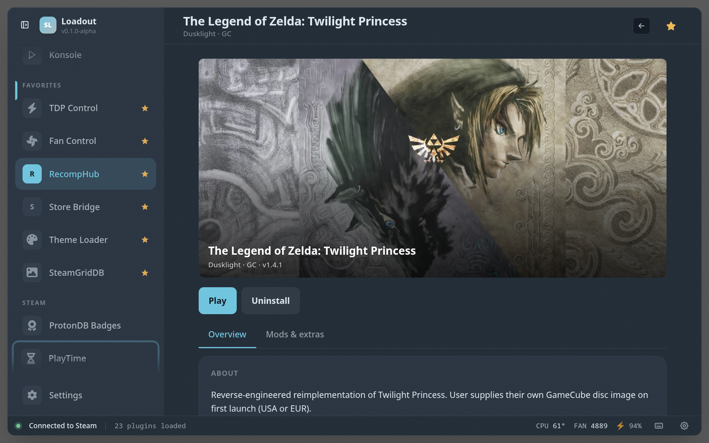
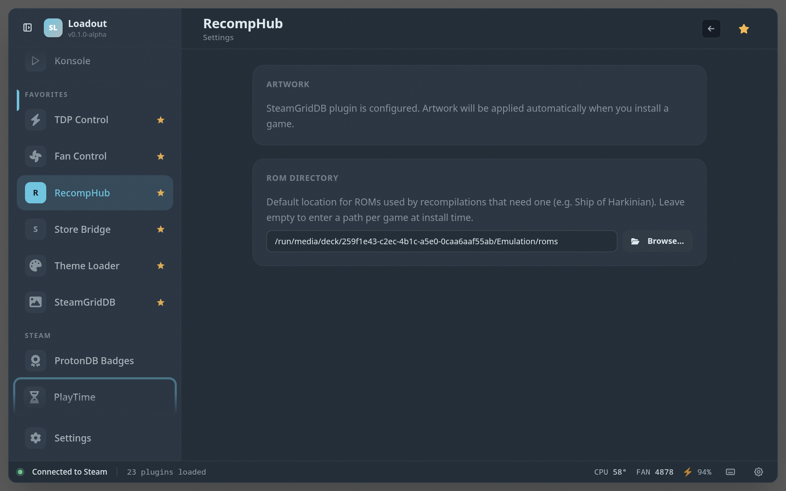

# RecompHub

> Browse, install, and play recompiled retro games natively

Browse, install, and launch community recompilations and native ports of classic games — you supply your own game files and it handles the rest, turning supported retro titles into properly native Linux builds.

## Screenshots

### Overview

### Game detail

### Settings

## See also

- [All plugins](../../README.md#plugins)
- [Plugin model](../../README.md#plugin-model)
