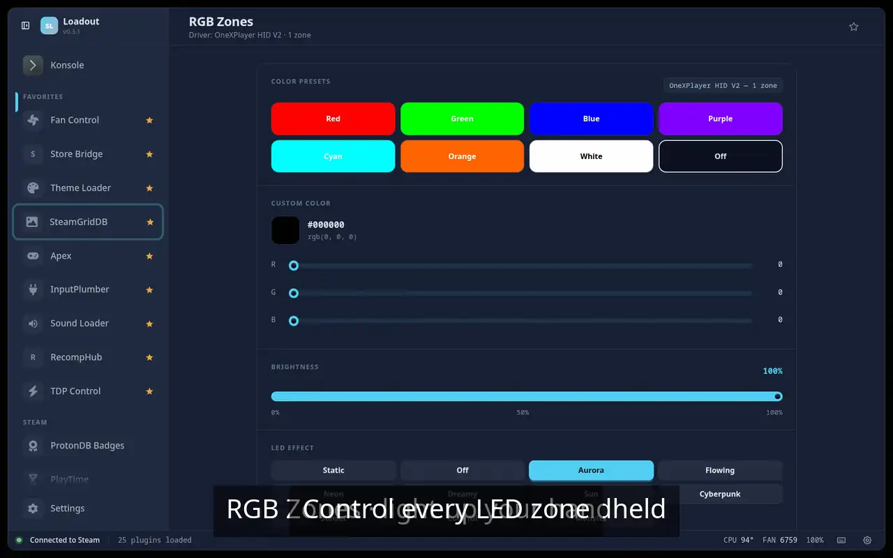
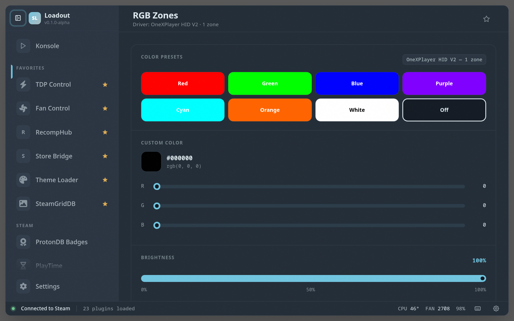

# RGB Control

> RGB LED control for Linux handhelds — supports OpenRGB, sysfs LEDs, and platform-specific interfaces

Control the RGB lighting on Linux handhelds via OpenRGB, sysfs LEDs, and platform-specific interfaces — set colours and effects, or kill the lights to save battery, without reaching for extra desktop tools.

## Demo

## Screenshots

## See also

- [All plugins](../../README.md#plugins)
- [Plugin model](../../README.md#plugin-model)
