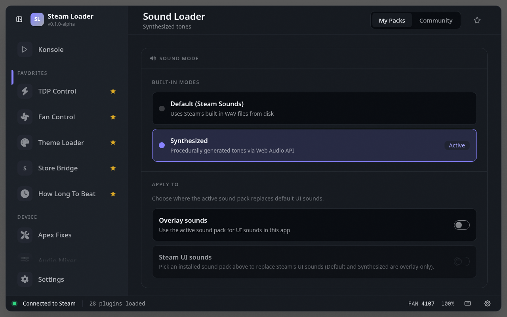

# Sound Loader

> Browse, install, and toggle community UI sound packs from deckthemes.com

Browse, install, and switch community UI sound packs from deckthemes.com, giving Steam's interface sounds a personal touch from inside Gaming Mode.

## Demo

## Screenshots

## See also

- [All plugins](../../README.md#plugins)
- [Plugin model](../../README.md#plugin-model)
