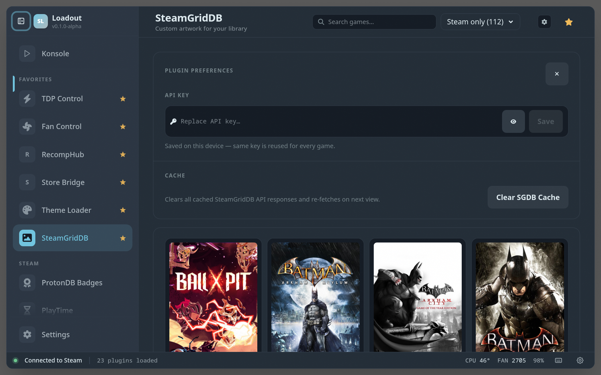

# SteamGridDB

> Browse and apply custom game art (grids, heroes, logos, icons) from SteamGridDB

## Screenshots

### Overview

### Game detail

### Settings

## See also

- [All plugins](../../README.md#plugins)
- [Plugin model](../../README.md#plugin-model)
