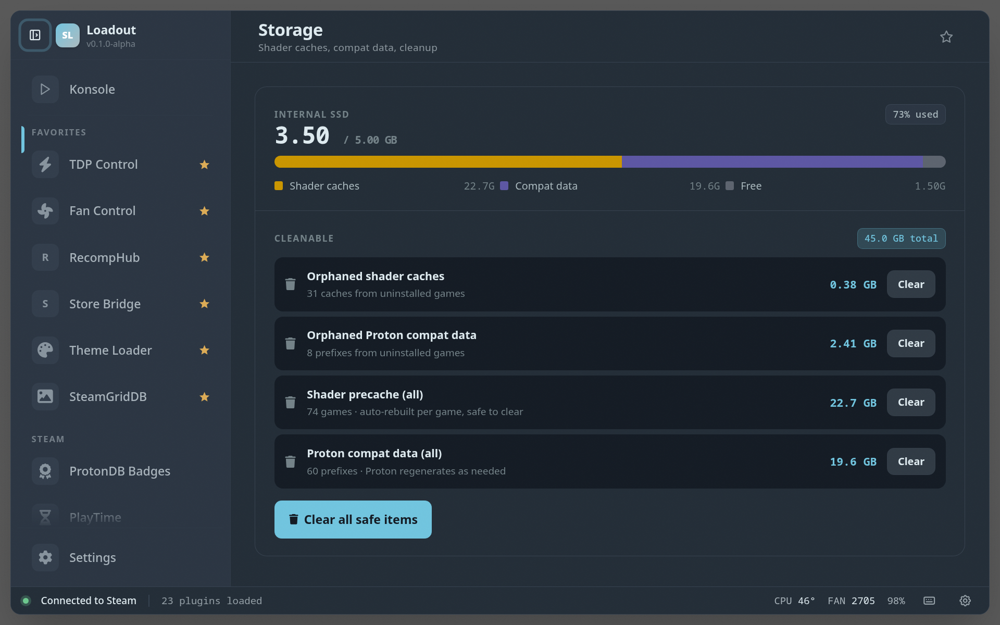

# Storage Cleaner

> Shows disk usage, shader cache sizes, and lets users clean up space

## Screenshots

## See also

- [All plugins](../../README.md#plugins)
- [Plugin model](../../README.md#plugin-model)
