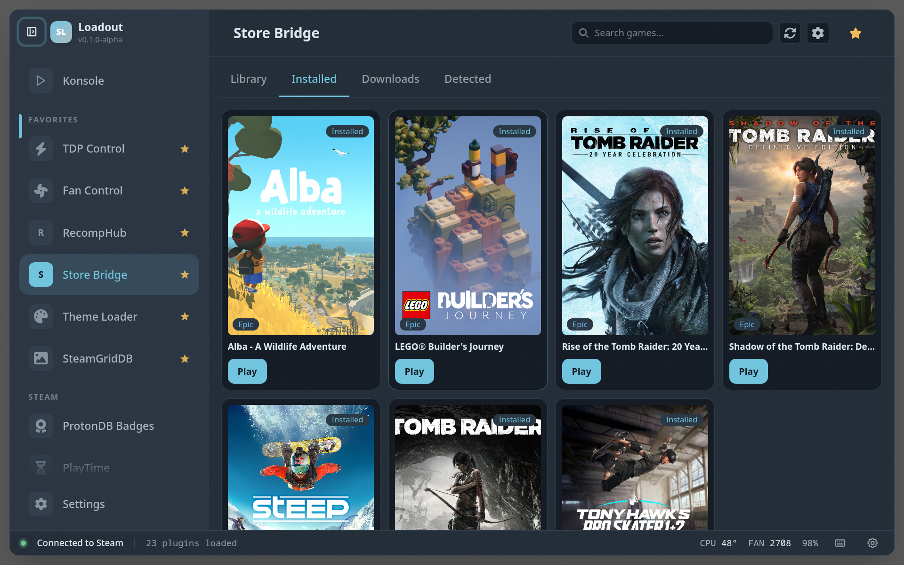
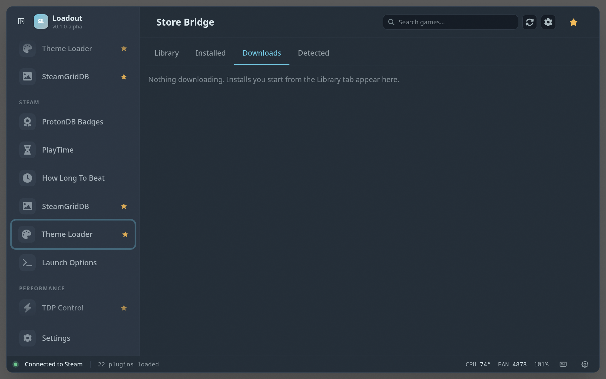
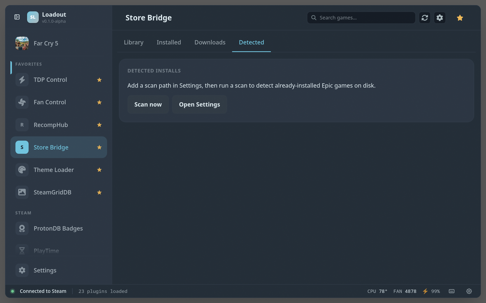
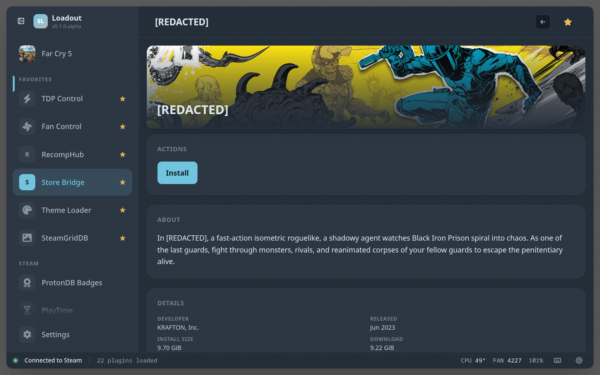
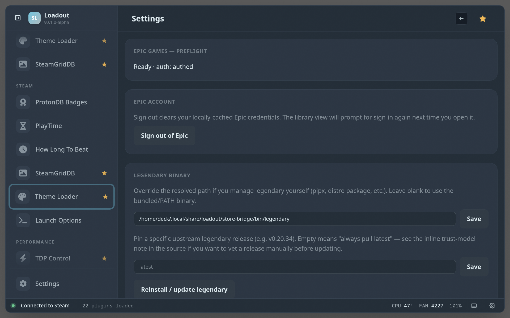

# Store Bridge

> Surface Epic, GOG, Amazon, Ubisoft and xCloud libraries as Steam shortcuts

Surfaces non-Steam storefront libraries and adds their games to Steam as shortcuts, so they install and launch right alongside everything else. **Epic Games is supported today**; GOG, Amazon, Ubisoft, and xCloud are on the roadmap.

## Screenshots

### Overview

### Installed games

### Downloads

### Detected games

### Game detail

### Settings

## See also

- [All plugins](../../README.md#plugins)
- [Plugin model](../../README.md#plugin-model)
