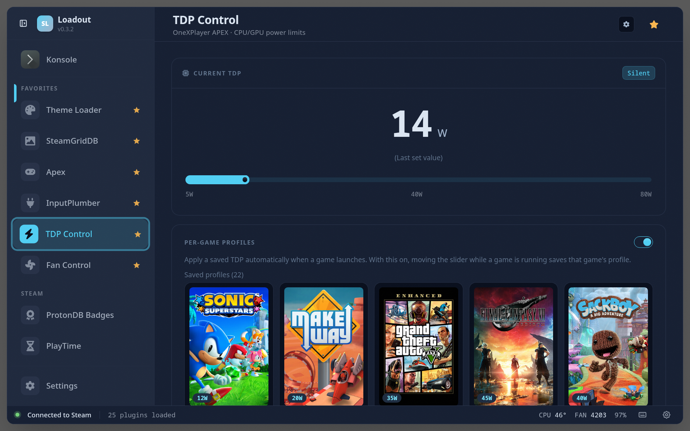
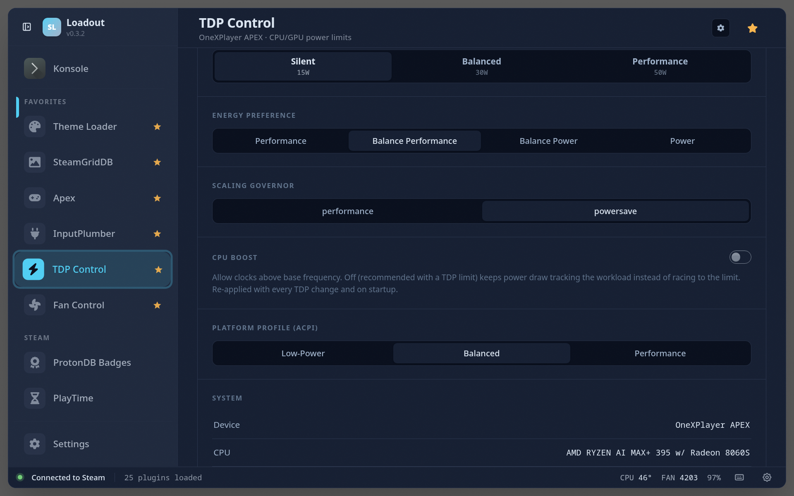
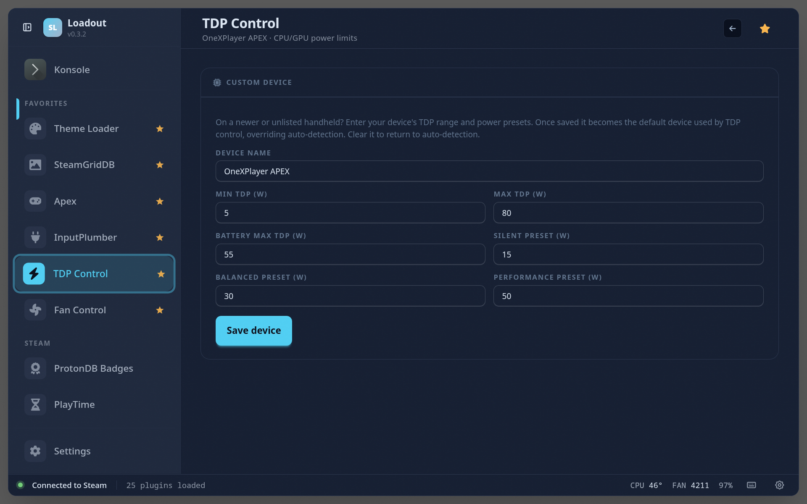

# TDP Control

> Adjust CPU/APU TDP wattage with presets and a slider

Set your CPU/APU power limit (TDP) with quick presets and a slider, optionally per game, to balance performance against battery life and heat — the single biggest knob for tuning a handheld.

Beyond the wattage itself, the plugin exposes the CPU knobs that decide how the chip *uses* that budget: energy-performance preference (EPP), scaling governor, platform profile, and CPU boost.

## CPU boost policy

A TDP limit alone doesn't govern power draw: with boost left on, the CPU races to its maximum clocks under any sustained load — regardless of governor or EPP — and fills whatever envelope the limit allows. The result is draw that sits *at the limit* instead of tracking the workload (a 45 W limit with a 30 fps cap burns 45 W where ~30 W would do).

TDP Control therefore keeps CPU boost **off by default**, and re-applies the setting alongside every TDP write and at service startup — the kernel resets the knob to on at every boot, so a one-time write wouldn't stick. If you want boost clocks anyway (e.g. plugged in, CPU-bound emulation), flip the **CPU Boost** toggle: your choice persists and is re-asserted the same way.

## Screenshots

### Overview

### CPU controls

### Settings

## See also

- [All plugins](../../README.md#plugins)
- [Plugin model](../../README.md#plugin-model)
