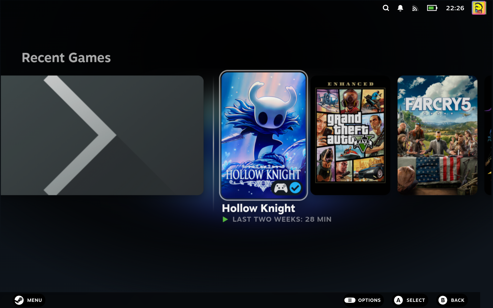

# Theme Loader

> Browse, install, and toggle community CSS themes for Steam's Big Picture UI

Browse, install, and toggle community CSS themes for Steam's Big Picture UI, restyling the interface to taste from inside Gaming Mode.

## Screenshots

### Plugin

### In Big Picture

A community theme restyling the Gaming Mode home and game pages:

## See also

- [All plugins](../../README.md#plugins)
- [Plugin model](../../README.md#plugin-model)
