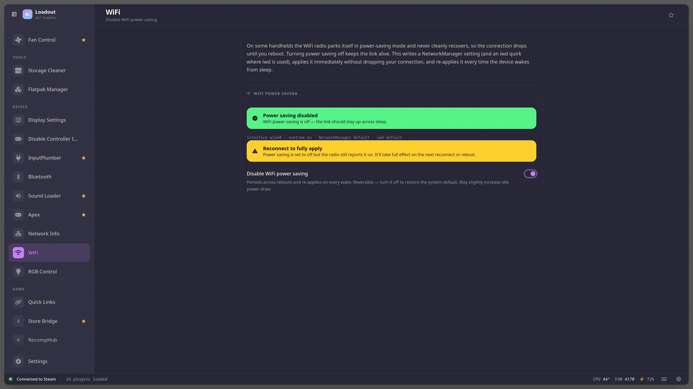

# WiFi

> Stop WiFi dropping out by disabling the radio's power saving. Writes a NetworkManager drop-in (and an iwd quirk where iwd is installed), applies it instantly, and re-asserts it on every wake. Cross-distro: SteamOS, Bazzite, CachyOS.

## Screenshots

## How it works

Toggling power saving off:

1. Writes `/etc/NetworkManager/conf.d/wifi-powersave-off.conf` (`wifi.powersave = 2`) — NetworkManager's "off" value, applied via nl80211 regardless of backend.
2. Where iwd is installed, merges `[DriverQuirks] PowerSaveDisable=*` into `/etc/iwd/main.conf` (existing sections are preserved).
3. Runs `nmcli general reload` so the new default goes live without a connection-dropping restart, then `iw dev <iface> set power_save off` for the current session.
4. Re-asserts the runtime state on every wake from sleep (power saving otherwise re-enables on resume).

Turn it off to remove the config and restore the system default.

## Caveats

- **SteamOS major updates** can reset `/etc`, dropping the config — re-toggle after a big SteamOS upgrade.
- A saved connection that pins `802-11-wireless.powersave` explicitly (some vendor images do) overrides the global default; this toggle sets the default, so such a connection would need its own `powersave` cleared.

## See also

- [All plugins](../../README.md#plugins)
- [Plugin model](../../README.md#plugin-model)
